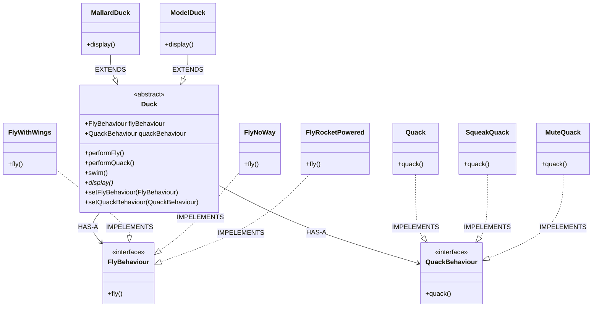

# Strategy Pattern Analysis - SimUDuck

This directory contains an implementation of the **Strategy Design Pattern** using the classic "SimUDuck" example.

## 1. Structure & Class Diagram

The system involves a `Duck` superclass that delegates its flying and quacking behaviors to interfaces (`FlyBehaviour` and `QuackBehaviour`), rather than implementing them directly or strictly inheriting them.

### Class Diagram (Mermaid)



## 2. Important Notes & Logic

### How it Works
1. **Separation of Concerns**: The behaviors (Flying, Quacking) are separated from the main object (Duck). The `Duck` class doesn't know *how* to fly; it just knows *that* it has an object that can handle flying.
2. **Delegation**: When `performFly()` is called on a Duck, the Duck delegates the call to its internal `flyBehaviour` object:
   ```java
   public void performFly() {
       flyBehaviour.fly(); // Delegation
   }
   ```
3. **Dynamic Behavior**: Because the behaviors are assigned to variables (`flyBehaviour`, `quackBehaviour`), they can be changed at runtime using setters (`setFlyBehaviour`).
   - *Example*: A `ModelDuck` might start with `FlyNoWay`, but later pick up a rocket, changing its behavior to `FlyRocketPowered` without changing the code of the `Duck` class itself.

## 3. Design Principles

### Principle 1: Favor Composition over Inheritance
**"HAS-A" can be better than "IS-A"**

*   **Inheritance (IS-A)**: If you put the `fly()` method in the `Duck` superclass, **ALL** ducks inherit it. This is bad for Rubber Ducks or Decoy Ducks that shouldn't fly. If you override `fly()` to do nothing in those subclasses, you are writing bad code across many files.
*   **Composition (HAS-A)**: Instead, the Duck *has* a `FlyBehaviour`. The Duck is composed of a FlyBehaviour. This allows you to mix and match behaviors (A Rubber Duck *has* `FlyNoWay` and `Squeak`).
*   **Benefit**: You can change behavior at runtime (by swapping the composed object), which is impossible with simple inheritance.

### Principle 2: Encapsulate What Varies
Identify the aspects of your application that vary and separate them from what stays the same.
*   **Varies**: Flying behavior, Quacking behavior.
*   **Stays the same**: Basic Duck properties (swimming, appearance/display method existing).
*   **Result**: Take the parts that vary and encapsulate them in their own set of classes (`FlyWithWings`, `FlyNoWay`, etc.).

### Principle 3: Program to an Interface, not an Implementation
The `Duck` class depends on the `FlyBehaviour` interface, not the specific `FlyWithWings` class.
*   **Why**: This decouples the code. The `Duck` doesn't care if the implementation is `FlyRocketPowered` or `FlyWithWings`, as long as it implements the `fly()` method contract.

## 4. Summary of Code Flow
1.  **Client** (`MiniDuckSimulator`) creates a `MallardDuck`.
2.  **MallardDuck Constructor** initializes inherited fields `flyBehaviour = new FlyWithWings()` and `quackBehaviour = new Quack()`.
3.  **Client** calls `performFly()`.
4.  **Duck** calls `flyBehaviour.fly()`.
5.  **Output**: "I'm Flying :-)".
6.  **Client** creates `ModelDuck` (initially cannot fly).
7.  **Client** calls `setFlyBehaviour(new FlyRocketPowered())`.
8.  **ModelDuck**'s `flyBehaviour` reference now points to the rocket object.
9.  **Client** calls `performFly()` again.
10. **Output**: "I'm flying with a rocket!".

## 5. Execution Output
```text
I'm a real Mallard Duck!
I'm Flying :-) 
Quack Quack!
---------Now the Model Duck!---------
I can't fly :-( 
I'm flying with a rocket!
```

