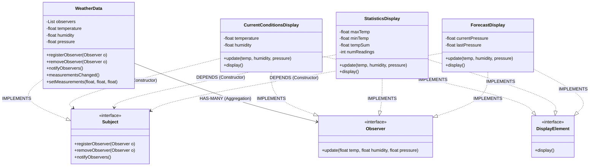

# Observer Pattern Analysis - Weather-O-Rama

This directory contains an implementation of the **Observer Design Pattern** applied to a Weather Monitoring Station example ("Weather-O-Rama").

## 1. Structure & Class Diagram

The system revolves around a `WeatherData` object (the Subject) that tracks weather metrics. Various Display elements (Observers) register with this Subject to receive updates whenever the weather measurements change.

### Class Diagram (Mermaid)



## 2. Important Notes & Logic

### How it Works
1.  **One-to-Many Relationship**: One Subject (`WeatherData`) is observed by many Observers (`Display` elements).
2.  **Registration**: Observers register themselves with the Subject using `registerObserver(this)`. They can also remove themselves at runtime.
3.  **Notification (Push Model)**: When data changes in `WeatherData`, it calls `notifyObservers()`. This iterates through the list of registered observers and calls their `update()` method, "pushing" the new data (temp, humidity, pressure) to them.
    *   *Note*: In this implementation, we push *all* data. A "Pull" model would have the observers retrieve only what they need from the Subject via getters.
4.  **Loose Coupling**: The `WeatherData` object doesn't know *what* the observers are (e.g., it doesn't know it's talking to a ForecastDisplay). It only knows they implement the `Observer` interface.

## 3. Design Principles

### Principle 1: Strive for Loosely Coupled Designs
**Between objects that interact.**
*   **Loose Coupling**: The Subject and Observers interact, but have very little knowledge of each other.
*   **Benefit**: 
    *   We can add new Observers (e.g., a `HeatIndexDisplay`) at any time without modifying the `WeatherData` code.
    *   Modifying the Subject code doesn't break the Observers (as long as the Interface allows).
    *   Subjects and Observers can be reused independently.

### Principle 2: Program to an Interface, not an Implementation
*   `WeatherData` holds a `List<Observer>`, not a list of specific display classes.
*   The Displays accept a `Subject` in their constructor to register, but (in this optimized version) do not hold a reference to it unnecessarily.

### Principle 3: Encapsulate What Varies
*   The state of the weather varies frequently. This state and the logic for notifying interested parties are encapsulated in the `WeatherData` object.
*   The logic for *how* to display the data varies by display (Current vs Stats vs Forecast).

## 4. Summary of Code Flow
1.  **Client** (`WeatherStation`) creates `WeatherData` (the Subject).
2.  **Client** creates the three Displays. Inside their constructors, they call `weatherData.registerObserver(this)`.
3.  **Simulation**: `weatherData.setMeasurements()` is called with new data.
4.  **Trigger**: `setMeasurements` calls `measurementsChanged`, which calls `notifyObservers`.
5.  **Update**: `notifyObservers` loops through the list and calls `update(80, 65, 30.4f)` on each display.
6.  **Display**: Each display updates its local state and calls `display()` to print the result.
7.  **Dynamic Unsubscription**: The `WeatherStation` removes and re-registers observers to demonstrate dynamic behavior.

## 5. Execution Output
```text
--- Update 1 (All Active) ---
Current conditions: 80.0F degrees and 65.0% humidity
Avg/Max/Min temperature = 80.0/80.0/80.0
Forecast: Improving weather on the way!

--- Update 2 (Forecast Unsubscribes) ---
Current conditions: 82.0F degrees and 70.0% humidity
Avg/Max/Min temperature = 81.0/82.0/80.0

--- Update 3 (Forecast Re-subscribes) ---
Current conditions: 78.0F degrees and 90.0% humidity
Avg/Max/Min temperature = 80.0/82.0/78.0
Forecast: Watch out for cooler, rainy weather!

--- Update 4 (Pressure Rises) ---
Current conditions: 76.0F degrees and 50.0% humidity
Avg/Max/Min temperature = 79.0/82.0/76.0
Forecast: Improving weather on the way!

--- Update 5 (Statistics Unsubscribes) ---
Current conditions: 70.0F degrees and 45.0% humidity
Forecast: Watch out for cooler, rainy weather!

--- Update 6 (Heatwave) ---
Current conditions: 95.0F degrees and 30.0% humidity
Forecast: More of the same

```

## 6. Tradeoffs & Future Problem Areas

While the current implementation works for this specific requirement, there are design decisions that might cause issues as the application scales.

### 1. Subject as an Interface vs. Abstract Class
*   **Current Approach**: `Subject` is an interface. `WeatherData` implements `registerObserver`, `removeObserver`, and `notifyObservers` manually.
*   **Tradeoff**: If we add more Subjects (e.g., `SatelliteData`, `GroundStationData`), we will have to **duplicate** the code for managing the `observers` list and the notification loop in every single class.
*   **Future Fix**: Create an abstract base class (e.g., `Observable`) that handles the list management and notification logic. Concrete subjects can then extend `Observable` and inherit this behavior for free. *Note: In Java, this uses up your one allowed inheritance slot.*

### 2. "Push" Model vs. "Pull" Model
*   **Current Approach**: The `update(temp, humidity, pressure)` method **pushes** every piece of data to every observer, regardless of whether they need it.
*   **Tradeoff**:
    *   **Rigidity**: If we add a new weather metric (e.g., `windSpeed`), we must break the `Observer` interface and update every single generic `Observer` implementation, even those that don't care about wind speed.
    *   **Inefficiency**: Observers receive data they don't use (e.g., `ForecastDisplay` might not need humidity).
*   **Future Fix**: Switch to a **Pull Model**.
    *   Change `update()` to accept no arguments (or just the Subject).
    *   Observers then use public getters (e.g., `weatherData.getTemperature()`) to **pull** only the data they need.

### 3. Encapsulation of Update Logic
*   **Current Approach**: The `setMeasurements` method updates all values and triggers notifications immediately.
*   **Tradeoff**: If we wanted to update individual values (e.g., `setTemperature(80)`), we might trigger a notification for just that one change, or we might want to wait until all values are updated before notifying. The current design tightly couples setting values with notification.
