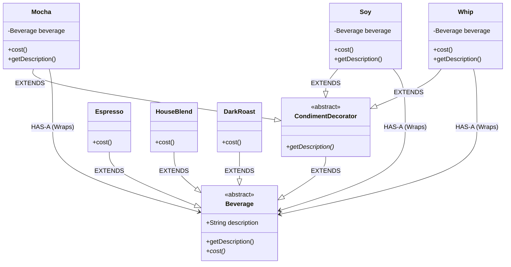

# Decorator Pattern Analysis - Starbuzz Coffee

This directory contains an implementation of the **Decorator Design Pattern** applied to the Starbuzz Coffee billing system. It closely follows the structure presented in *Head First Design Patterns*.

## 1. Structure & Class Diagram

The system involves a `Beverage` abstract superclass. Concrete beverages (`Espresso`, `HouseBlend`) extend it directly. Decorators (`CondimentDecorator`) also extend `Beverage` but *contain* a reference to another `Beverage`, allowing them to wrap objects dynamically.

### Class Diagram (Mermaid)



## 2. Important Notes & Logic

### Why this structure?
This implementation highlights a core design decision: **Using Inheritance to achieve Type Matching, not for behavior.**

1.  **Inheritance (`extends Beverage`)**:
    *   **Goal**: To allow a `Mocha` to be passed into any method that expects a `Beverage`.
    *   **The Check**: If we didn't extend `Beverage`, we couldn't wrap a `Mocha` inside another `Mocha` (because the constructor expects a `Beverage`).
2.  **Composition (`Beverage beverage`)**:
    *   **Goal**: To add behavior dynamically.
    *   **The Check**: Instead of inheriting `cost()` from the parent, we *calculate* it by asking the *wrapped* object for its cost and adding ours.

### How it Works
1.  **Wrapper Objects**: Decorators are like wrappers. A `Mocha` object holds a reference to a `Beverage` (which could be an `Espresso` or already another `Mocha`).
2.  **Transparent API**: Because `CondimentDecorator` extends `Beverage`, a decorated object *is-a* `Beverage`. The client (StarBuzzCoffee) treats the wrapped object exactly the same as a plain object.
3.  **Delegation with Augmentation**:
    *   When `cost()` is called on `Mocha`, it calls `cost()` on the *wrapped* beverage, adds its own price ($0.20), and returns the total.
    *   This creates a chain: `Whip` -> `Mocha` -> `Mocha` -> `DarkRoast`. Calling `cost()` on the outer Whip triggers the calculation all the way down.

## 3. Design Principles

### Principle 1: The Open-Closed Principle
**Classes should be open for extension, but closed for modification.**
*   **Closed**: We don't modify `Espresso` or `HouseBlend` or the `Beverage` superclass every time we add a new condiment.
*   **Open**: We can add a new condiment (e.g., `Caramel`) easily by just extending `CondimentDecorator`. We extend the behavior without touching existing code.

### Principle 2: Favor Composition over Inheritance
*   Instead of creating thousands of subclasses like `DarkRoastWithMochaAndWhip` (Inheritance explosion), we compose the drink at runtime by wrapping objects.
*   This allows mixing and matching condiments in ways the original designer might not have foreseen.

## 4. Summary of Code Flow
1.  **Creation**: `Beverage beverage = new DarkRoast();` (Cost: .99)
2.  **Decoration 1**: `beverage = new Mocha(beverage);` (Wraps DarkRoast. New Cost: .99 + .20)
3.  **Decoration 2**: `beverage = new Mocha(beverage);` (Wraps previous Mocha. New Cost: .99+ .20 + .20)
4.  **Decoration 3**: `beverage = new Whip(beverage);` (Wraps second Mocha. New Cost: .99 + .20 + .20 + .10)
5.  **Execution**: `beverage.cost()` is called. The calls ripple down the chain and bubble back up with the sum ($1.49).

## 5. Execution Output
```text
Espresso $1.99
Dark Roast Coffee, Mocha, Mocha, Whip $1.49
House Blend Coffee, Soy, Mocha, Whip $1.34
```

## 6. Tradeoffs & Potential Issues

While the Decorator Pattern solves the class explosion problem, it introduces its own set of challenges.

### 1. Small Class Explosion
*   **Problem**: In your file explorer, you can see `Mocha`, `Soy`, `Whip`, `Espresso`, `DarkRoast`... The pattern results in a large number of small classes that differ only in simple behavior.
*   **Effect**: This can make the library harder to learn for a new developer ("Where is the logic? It's spread across 20 tiny files").

### 2. Type Identity Issues
*   **Problem**: A client might be expecting a specific type, like `DarkRoast`. Once you wrap it in `Mocha`, it is no longer an instance of `DarkRoast` (it is a `Mocha`).
*   **Effect**: If you have code that relies on `instanceof DarkRoast`, it will break when you decorate it. The Decorator pattern is meant for transparent components, not code that inspects the *specific* concrete class underneath.

### 3. Instantiation Complexity
*   **Problem**: Building a drink requires a long chain of `new`:
    ```java
    Beverage b = new Whip(new Mocha(new Mocha(new DarkRoast())));
    ```
*   **Effect**: This is verbose and can lead to bugs (creating the wrong order, though order usually doesn't matter here).
*   **Future Fix**: This is often solved by introducing a **Factory** or **Builder** pattern to handle the creation logic, hiding the "wrapping" mess from the client code.
