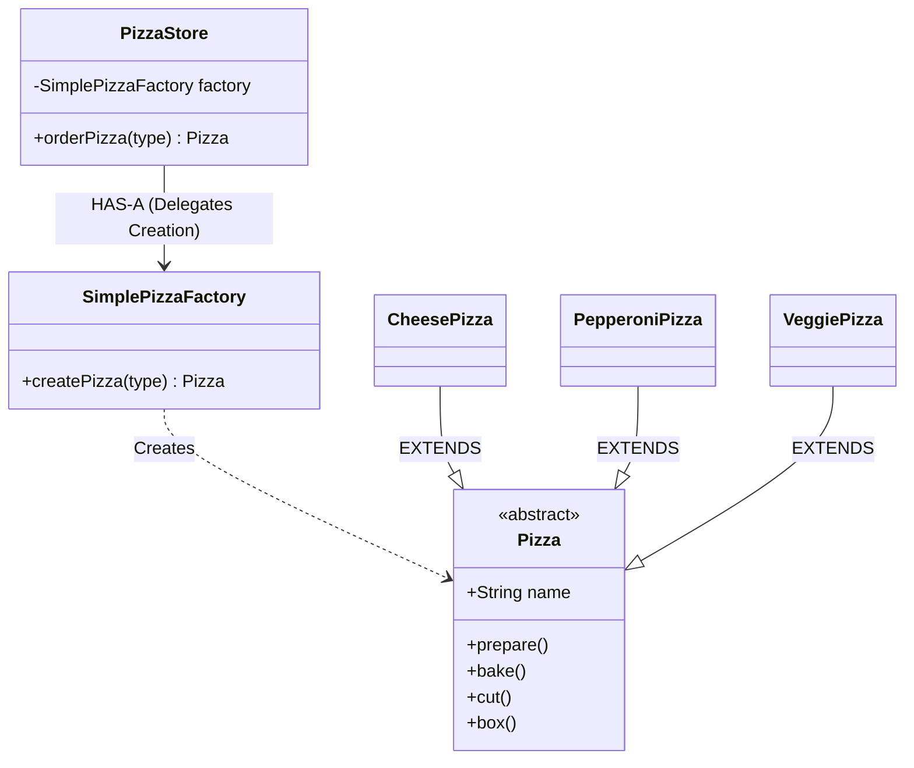

# Simple Factory Pattern Analysis - Pizza Store

This directory contains an implementation of the **Simple Factory** idiom (often mistaken for the Factory Method Pattern) applied to a Pizza Store system. It follows the example from *Head First Design Patterns*.

## 1. Structure & Class Diagram

The system separates the code that *uses* the pizza (the Client/`PizzaStore`) from the code that *creates* the pizza (the Factory/`SimplePizzaFactory`).

### Class Diagram (Mermaid)



## 2. Important Notes & Logic

### The Problem it Solves
In a naive implementation, `PizzaStore` would look like this:
```java
public Pizza orderPizza(String type) {
    Pizza pizza;
    // The "New" Trap:
    if (type.equals("cheese")) {
        pizza = new CheesePizza(); // Tightly coupled to concrete classes
    } else if (type.equals("pepperoni")) {
        pizza = new PepperoniPizza();
    }
    // ... preparation logic
}
```
If we add a new pizza type (e.g., `ClamPizza`), we have to modify `PizzaStore`. This violates the **Open-Closed Principle** (Open for extension, closed for modification) if `PizzaStore` is complex.

### The Solution: Simple Factory
1.  **Encapsulation**: We take the "what varies" (the instantiation logic) and move it out of `PizzaStore` into a dedicated object, `SimplePizzaFactory`.
2.  **Delegation**: The `PizzaStore` now holds a reference to the factory. When it needs a pizza, it asks the factory to augment it.
3.  **Client Decoupling**: `PizzaStore` no longer needs to know about concrete classes like `CheesePizza` or `VeggiePizza`. It only knows about the `Pizza` interface and the `SimplePizzaFactory`.

## 3. Design Principles

### Principle 1: Encapsulate What Varies
The code that changes (instantiation of different pizza types) is separated from the code that stays the same (the `orderPizza` preparation flow: prepare -> bake -> cut -> box).

### Principle 2: Program to an Interface, not an Implementation
`PizzaStore` works with `Pizza`, not `CheesePizza`. It delegates the creation of the specific implementation to the factory.

## 4. Summary of Code Flow
1.  **Bootstrapping**: `Main` creates a `SimplePizzaFactory`.
2.  **Injection**: `Main` creates a `PizzaStore` and passes the factory to it.
3.  **Order**: Client calls `store.orderPizza("cheese")`.
4.  **Creation**: `PizzaStore` calls `factory.createPizza("cheese")`.
5.  **Logic**: Factory returns a `new CheesePizza()`.
6.  **Processing**: `PizzaStore` proceeds to call `prepare()`, `bake()`, etc., on the returned object, unaware of its concrete type.

## 5. Execution Output

When running `java Main`, we get:

```text
Preparing Cheese Pizza
Baking Cheese Pizza
Cutting Cheese Pizza
Boxing Cheese Pizza
We ordered a Cheese Pizza

Preparing Veggie Pizza
Baking Veggie Pizza
Cutting Veggie Pizza
Boxing Veggie Pizza
We ordered a Veggie Pizza
```

## 6. Tradeoffs & Potential Issues

### 1. Simple Factory is an "Idiom", not a full Pattern
*   **Limitation**: It simply moves the problematic code (the `if/else` block) to another class. It doesn't actually remove the dependency on concrete classes; it just concentrates it in one place (`SimplePizzaFactory`).
*   **Comparison**: The full **Factory Method Pattern** (which we might see in the next chapter) creates an abstract *method* in `PizzaStore` that subclasses (like `NYPizzaStore`, `ChicagoPizzaStore`) override to create their own style of pizzas.

### 2. Static Factories
*   Sometimes implementation defines `createPizza` as `static`. This is common (Static Factory), but it has the downside that you can't subclass the factory or mock it easily for testing.

## 7. Workflow & Thought Process

1.  **Identify the Pain Point**: We noticed `PizzaStore.java` had specific instantiation logic (`new CheesePizza()`) mixed with processing logic.
2.  **Refactor**: Extracted the instantiation logic into `SimplePizzaFactory.java`.
3.  **Wiring**: Updated `PizzaStore` to accept a factory in its constructor (Dependency Injection).
4.  **Verification**: Created `Main.java` to simulate ordering a pizza and verify the console output matches the expected lifecycle.
