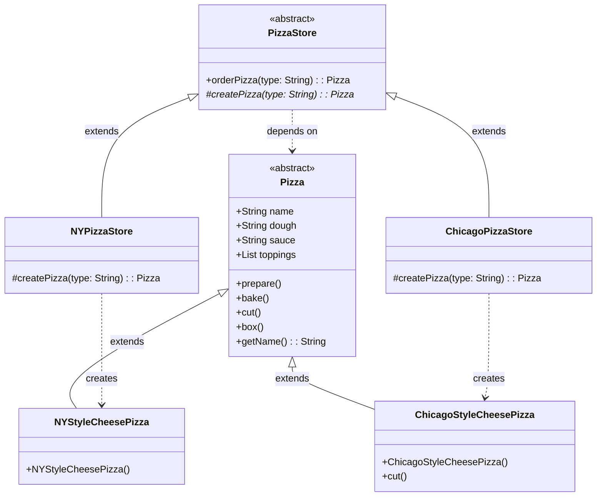

# Factory Method Pattern Analysis - Pizza Store
This directory contains an implementation of the **Factory Method Pattern** applied to a Pizza Store system. It follows the example from Head First Design Patterns.

## 1. Structure & Class Diagram
The system defines an interface for creating a pizza but lets subclasses (`NYPizzaStore`, `ChicagoPizzaStore`) decide which class to instantiate. The Creator (`PizzaStore`) is decoupled from the actual Concrete Products (`NYStyleCheesePizza`, etc).



## 2. Important Notes & Logic

### The Problem it Solves
In a naive or Simple Factory implementation, all pizza creation logic is centralized. If we have different *styles* of pizzas (NY vs Chicago) that need different preparation sequences or ingredients, a single factory becomes a mess of conditional logic. Furthermore, the central store would be tightly coupled to every single concrete pizza type.

### The Solution: Factory Method
*   **Decentralization**: We let each region (subclass) implement its own creation logic.
*   **Polymorphism**: The `PizzaStore` (Creator) defines the protocol (`orderPizza`) but the `createPizza` method is managed by the subclasses.
*   **Client Decoupling**: The Client (`PizzaTestDrive`) acts as a user of `PizzaStore` and does not need to know the specific details of `NYStyleCheesePizza`.

## 3. Design Principles

### Principle 1: Dependency Inversion Principle
Depend upon abstractions. Do not depend upon concrete classes.
The high-level component (`PizzaStore`) and low-level components (`NYStyleCheesePizza`) both depend on abstractions (`Pizza`).

### Principle 2: Open-Closed Principle
Open for extension, closed for modification.
We can add a `CaliforniaPizzaStore` without touching the existing `PizzaStore` logic. We utilize inheritance to extend the behavior.

## 4. Summary of Code Flow

*   **Bootstrapping**: `Main` instantiates specific stores: `NYPizzaStore` and `ChicagoPizzaStore`.
*   **Order**: Client calls `nyStore.orderPizza("cheese")`.
*   **Delegation**: `orderPizza` calls the abstract `createPizza("cheese")` method. This is the key "hook" for subclasses.
*   **Creation**: The subclass (`NYPizzaStore`) intercepts the call and instantiates `new NYStyleCheesePizza()`.
*   **Processing**: The base `PizzaStore` proceeds to call `prepare()` on the returned object, unaware it is specifically a NY style pizza.

## 5. Execution Output
When running `java PizzaTestDrive`, we get:

```text
Preparing NY Style Sauce and Cheese Pizza
Tossing dough...
Adding sauce...
Adding toppings: 
    Grated Reggiano Cheese
Baking for 25 minutes at 350
Cutting the pizza into diagonal slices
Place pizza in official PizzaStore box
Ethan ordered a NY Style Sauce and Cheese Pizza

Preparing Chicago Style Deep Dish Cheese Pizza
Tossing dough...
Adding sauce...
Adding toppings: 
    Shredded Mozzarella Cheese
Baking for 25 minutes at 350
Cutting the pizza into square slices
Place pizza in official PizzaStore box
Joel ordered a Chicago Style Deep Dish Cheese Pizza
```

## 6. Tradeoffs & Potential Issues

### 1. Complexity vs Flexibility
**Tradeoff**: This pattern adds more classes (a Creator and Product for every type) compared to a Simple Factory.
**Benefit**: It provides a architectural hook for subclasses to change the way objects are created, offering much more flexibility than a Simple Factory.

### 2. Class Explosion
If we have 20 different regions, we need 20 `PizzaStore` subclasses. This can clutter the project structure.

## 7. Workflow & Thought Process

*   **Identify the Pain Point**: We realized that a single `SimplePizzaFactory` was too rigid. Different regions wanted their own variations of factory logic (NY uses thin crust, Chicago uses deep dish), but we wanted to keep the `orderPizza` process (prepare, bake, cut, box) consistent.
*   **Refactor**: We transformed `PizzaStore` into an abstract class and defined completely abstract `createPizza` method.
*   **Wiring**: We created subclasses (`NYPizzaStore`, `ChicagoPizzaStore`) to implement the specific instantiation logic.
*   **Verification**: Ran `PizzaTestDrive` to ensure that `orderPizza` acts polymorphically—creating the correct style of pizza depending on which Store performs the operation.
