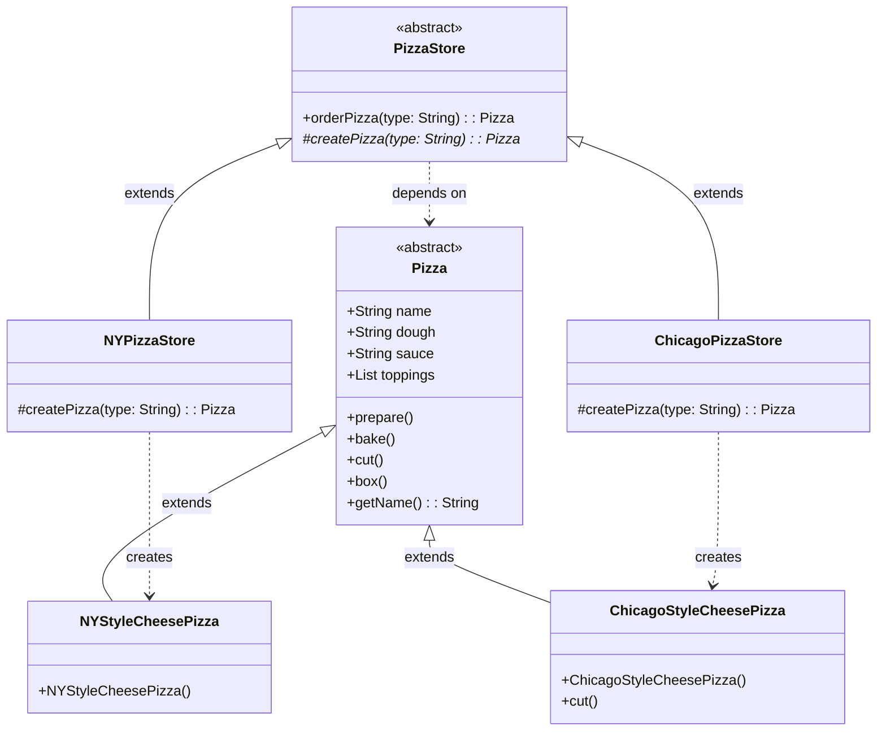

# Factory Method Pattern Analysis - Head First Design Patterns

## 1. Structure & Class Diagram

### Class Diagram



### Structure Overview
- **Product (`Pizza`)**: The abstract class defining the interface for the objects the factory method creates.
- **Concrete Products (`NYStyleCheesePizza`, `ChicagoStyleCheesePizza`)**: Specific implementations of the product interface.
- **Creator (`PizzaStore`)**: The abstract class that declares the factory method (`createPizza`). It also contains logic (`orderPizza`) that relies on the objects created by the factory method.
- **Concrete Creators (`NYPizzaStore`, `ChicagoPizzaStore`)**: Subclasses that override the factory method to return an instance of a specific Concrete Product.

---

## 2. Important Notes & Logic

### Factory Method Definition
The Factory Method Pattern defines an interface for creating an object, but lets subclasses decide which class to instantiate. Factory Method lets a class defer instantiation to subclasses.

### Key Implementation Details
- **Decoupling**: The `PizzaStore` (Creator) code calls `createPizza` and then calls `prepare`, `bake`, `cut`, `box` on the result. It **does not know** the actual concrete type of the pizza.
- **Encapsulation**: The creation logic is encapsulated in the `createPizza` method of specific stores. `NYPizzaStore` knows how to make NY style pizzas, and `ChicagoPizzaStore` knows how to make Chicago style pizzas.
- **Inversion of Control**: Instead of the high-level code (`PizzaStore`) depending on low-level concrete classes (`NYStyleCheesePizza`), both depend on the abstraction (`Pizza`).

---

## 3. Design Principles

1.  **Dependency Inversion Principle**: Depend upon abstractions. Do not depend upon concrete classes.
    -   The `PizzaStore` depends on the `Pizza` abstraction, not on `NYStyleCheesePizza` directly.
    -   The high-level component (`PizzaStore`) and low-level components (`Pizza` subclasses) both depend on the abstraction (`Pizza`).
2.  **Open/Closed Principle**: Classes should be open for extension, but closed for modification.
    -   We can add new pizza types (e.g., `CaliforniaPizzaStore` and `CaliforniaStylePizza`) without modifying the existing `PizzaStore` code.
3.  **Encapsulate what varies**: The code that creates pizzas is what varies across different regions, so it is encapsulated into its own method (`createPizza`) which is then overridden by subclasses.

---

## 4. Summary of Code Flow

1.  **Client Usage**: The `PizzaTestDrive` class (client) instantiates a specific Store, e.g., `NYPizzaStore`.
2.  **Ordering**: The client calls `nyStore.orderPizza("cheese")`.
3.  **Creation (The Factory Method)**: Inside `orderPizza`, the code calls `createPizza("cheese")`.
    -   Since `nyStore` is an instance of `NYPizzaStore`, the `NYPizzaStore.createPizza()` method is executed.
    -   This method returns a `new NYStyleCheesePizza()`.
4.  **Processing**: The `orderPizza` method receives the `Pizza` object. It then calls:
    -   `prepare()`: Prints preparation steps specific to the concrete pizza (name, dough, sauce).
    -   `bake()`: Defaults to generic baking.
    -   `cut()`: Defaults to generic cutting (diagonal) OR specific cutting (square for Chicago).
    -   `box()`: Defaults to generic boxing.
5.  **Result**: The prepared pizza is returned to the client.

---

## 5. Execution Output

When running `java PizzaTestDrive`, the following output is observed:

```text
Preparing NY Style Sauce and Cheese Pizza
Tossing dough...
Adding sauce...
Adding toppings: 
    Grated Reggiano Cheese
Baking for 25 minutes at 350
Cutting the pizza into diagonal slices
Place pizza in official PizzaStore box
Ethan ordered a NY Style Sauce and Cheese Pizza

Preparing Chicago Style Deep Dish Cheese Pizza
Tossing dough...
Adding sauce...
Adding toppings: 
    Shredded Mozzarella Cheese
Baking for 25 minutes at 350
Cutting the pizza into square slices
Place pizza in official PizzaStore box
Joel ordered a Chicago Style Deep Dish Cheese Pizza
```

**Observation**:
- Notice the difference in "Cutting":
    - NY Style: "Cutting the pizza into diagonal slices" (Default implementation).
    - Chicago Style: "Cutting the pizza into square slices" (Overridden implementation).

---

## 6. Tradeoffs & Potential Issues

### Tradeoffs (Pros)
-   **Flexibility**: Easy to add new types of products without breaking existing client code.
-   **Single Responsibility**: Creation code is separated from the operation code.

### Potential Issues (Cons)
-   **Class Explosion**: Requires creating a concrete subclass for every new type of product creator (e.g., if you have 10 regions, you need 10 Store subclasses).
-   **Complexity**: Increases the number of classes in the application, which can make the code harder to follow for simple use cases.

---

## 7. Workflow & Thought Process

### 1. Identify the Problem
We started with a need to separate the code that *uses* the pizza (preparation, baking, etc.) from the code that *creates* the pizza. Different regions (NY, Chicago) needed different pizzas but followed the same preparation process.

### 2. Abstraction
-   Created an abstract `Pizza` class to define the common interface.
-   Created an abstract `PizzaStore` class to define the common workflow (`orderPizza`).

### 3. Application of Factory Method
-   Moved the instantiation logic (`new NYStyleCheesePizza()`) out of the main `orderPizza` method.
-   Declared an abstract method `createPizza(String type)` in `PizzaStore`.
-   This pushed the responsibility of instantiation down to the subclasses (`NYPizzaStore`, `ChicagoPizzaStore`).

### 4. Implementation
-   Implemented `NYPizzaStore` to return NY-style pizzas.
-   Implemented `ChicagoPizzaStore` to return Chicago-style pizzas.
-   Customized `ChicagoStyleCheesePizza` to override the `cut()` method, demonstrating that products can have specific behaviors while conforming to the interface.

### 5. Verification
-   Wrote `PizzaTestDrive` to verify that ordering from `NYPizzaStore` yields a NY pizza and `ChicagoPizzaStore` yields a Chicago pizza, confirming the polymorphism works as expected.
