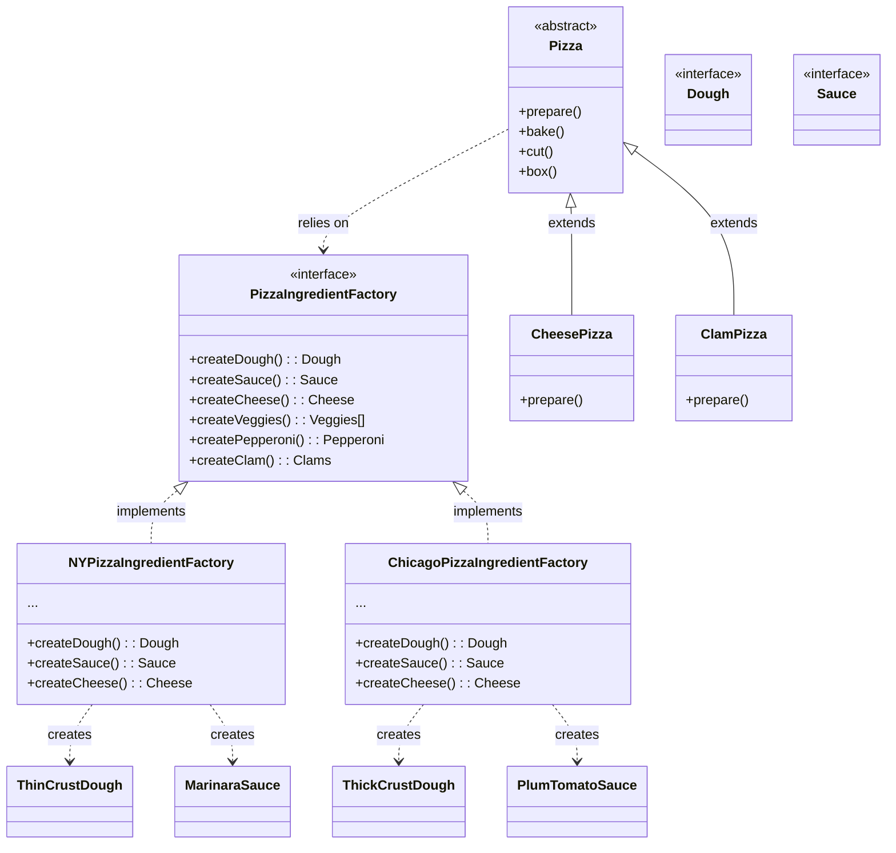

# Abstract Factory Pattern Analysis - Pizza Ingredient Factory
This directory contains an implementation of the **Abstract Factory Pattern** applied to a Pizza Ingredient system. It follows the example from Head First Design Patterns.

## 1. Structure & Class Diagram
The system defines an abstract factory interface (`PizzaIngredientFactory`) for creating families of related or dependent objects (ingredients) without specifying their concrete classes. The Client (`Pizza`) is decoupled from the actual Concrete Ingredients (`MarinaraSauce`, `ThinCrustDough`, etc).



## 2. Important Notes & Logic

### The Problem it Solves
In the previous Factory Method approach, while we decoupled the pizza creation, the specific *ingredients* were still somewhat loosely handled. We want to ensure that a NY Style Pizza *always* uses thin crust and marinara sauce, while a Chicago Style Pizza *always* uses thick crust and plum tomato sauce. We need to enforce "families" of ingredients.

### The Solution: Abstract Factory
*   **Families of Products**: The `PizzaIngredientFactory` is responsible for creating an entire family of products (dough, sauce, cheese, etc.).
*   **Consistency**: By passing a specific factory (e.g., `NYPizzaIngredientFactory`) to a `Pizza`, we ensure that the pizza uses *only* ingredients from that region.
*   **Composition**: The `Pizza` code is composed with the Factory. It asks the factory for ingredients, rather than instantiating them directly.

## 3. Design Principles

### Principle 1: Dependency Inversion Principle
Depend upon abstractions. Do not depend upon concrete classes.
The `Pizza` class depends only on the `PizzaIngredientFactory` interface and the ingredient interfaces (`Dough`, `Sauce`). It knows nothing about `ThinCrustDough` or `NYPizzaIngredientFactory`.

### Principle 2: Encapsulate What Changes
The specific implementations of ingredients (which vary by region) are encapsulated within their respective concrete factories. The client code (`Pizza`) remains unchanged even if we change the ingredients for a region.

## 4. Summary of Code Flow

*   **Bootstrapping**: `PizzaTestDrive` instantiates `NYPizzaStore` and `ChicagoPizzaStore`.
*   **Order**: Client calls `nyStore.orderPizza("cheese")`.
*   **Creation**: `NYPizzaStore` creates the `NYPizzaIngredientFactory` and passes it to a new `CheesePizza`.
*   **Preparation**: The `CheesePizza`'s `prepare()` method is called.
*   **Delegation**: Inside `prepare()`, the pizza asks the factory: `dough = ingredientFactory.createDough()`.
*   **Resolution**: Since the factory is a `NYPizzaIngredientFactory`, it returns a `ThinCrustDough`. The pizza is populated with NY-style ingredients.

## 5. Execution Output
When running `java PizzaTestDrive`, we get:

```text
--- Making a New York Style Cheese Pizza ---
Preparing New York Style Cheese Pizza
Bake for 25 minutes at 350
Cutting the pizza into diagonal slices
Place pizza in official PizzaStore box
Ethan ordered a New York Style Cheese Pizza

--- Making a Chicago Style Cheese Pizza ---
Preparing Chicago Style Cheese Pizza
Bake for 25 minutes at 350
Cutting the pizza into diagonal slices
Place pizza in official PizzaStore box
Joel ordered a Chicago Style Cheese Pizza

--- Making a New York Style Clam Pizza ---
Preparing New York Style Clam Pizza
Bake for 25 minutes at 350
Cutting the pizza into diagonal slices
Place pizza in official PizzaStore box
Ethan ordered a New York Style Clam Pizza

--- Making a Chicago Style Clam Pizza ---
Preparing Chicago Style Clam Pizza
Bake for 25 minutes at 350
Cutting the pizza into diagonal slices
Place pizza in official PizzaStore box
Joel ordered a Chicago Style Clam Pizza
```

## 6. Tradeoffs & Potential Issues

### 1. Complexity
**Tradeoff**: Abstract Factory introduces many interfaces and classes. Each ingredient needs an interface and multiple implementations.
**Benefit**: It provides strong consistency guarantees. You cannot accidentally mix NY Dough with Chicago Sauce if you use the factories correctly.

### 2. Difficulty Extending Families
If we want to add a new *type* of ingredient (e.g., `OliveOil`) to the factory, we must change the `PizzaIngredientFactory` interface, which breaks *all* concrete factory implementations (NY, Chicago, etc).

## 7. Workflow & Thought Process

*   **Identify the Pain Point**: We needed to ensure that pizzas used the correct set of ingredients (families) without hardcoding them into the Pizza classes.
*   **Define the Interface**: Created `PizzaIngredientFactory` defining methods for all ingredients.
*   **Implement Concrete Factories**: Built `NYPizzaIngredientFactory` and `ChicagoPizzaIngredientFactory` to return region-specific ingredients.
*   **Refactor Product**: Updated `Pizza` to accept a factory and use it to create ingredients in the `prepare()` method.
*   **Integrate**: Updated `PizzaStore` to pass the correct factory when creating pizzas.
