# Singleton Pattern

## 1. Structure & Class Diagram

The Singleton Pattern ensures that a class has only one instance and provides a global point of access to it. We have implemented five variations of this pattern.

### Class Structure
- **ClassicSingleton**: Private constructor, static instance variable, static `getInstance()` method.
- **SynchronizedSingleton**: Adds `synchronized` to `getInstance()`.
- **EagerSingleton**: Static initialization of the instance.
- **DoubleCheckedLockingSingleton**: Uses `volatile` and synchronized block within `getInstance()`.
- **EnumSingleton**: Uses Java `enum` type.

```mermaid
classDiagram
    class ClassicSingleton {
        -static ClassicSingleton uniqueInstance
        -ClassicSingleton()
        +static ClassicSingleton getInstance()
    }
    class SynchronizedSingleton {
        -static SynchronizedSingleton uniqueInstance
        -SynchronizedSingleton()
        +static synchronized SynchronizedSingleton getInstance()
    }
    class EagerSingleton {
        -static EagerSingleton uniqueInstance
        -EagerSingleton()
        +static EagerSingleton getInstance()
    }
    class DoubleCheckedLockingSingleton {
        -static volatile DoubleCheckedLockingSingleton uniqueInstance
        -DoubleCheckedLockingSingleton()
        +static DoubleCheckedLockingSingleton getInstance()
    }
    class EnumSingleton {
        <<enumeration>>
        UNIQUE_INSTANCE
        +performAction()
    }
```



## 2. Important Notes & Logic

The core logic of the Singleton pattern revolves around obstructing the creation of objects by other classes and providing a controlled mechanism to access the single instance.

### Key Implementation Details:
1.  **Private Constructor**: This is the most critical part. It prevents other classes from instantiating the Singleton using the `new` keyword.
2.  **Static Variable**: Holds the single instance of the class.
3.  **Static Method (`getInstance`)**: Provides the global access point. It handles the creation (if necessary) and return of the instance.
4.  **Classic (Lazy)**: Checks if instance is null, then creates. **Fault**: Not thread-safe.
5.  **Synchronized**: Locks the method to ensure thread safety. **Fault**: Performance hit.
6.  **Eager**: Creates instance at class load time. **Fault**: No lazy loading.
7.  **Double-Checked**: Checks null once (no lock), then locks, then checks null again. **Fault**: Complex syntax, requires `volatile` (Java 5+).
8.  **Enum**: Java's native way to handle singletons. **Fault**: Cannot extend classes.

## 3. Design Principles

-   **Encapsulate What Varies**: The creation logic is encapsulated within the class itself.
-   **Single Responsibility Principle**: A loose interpretation - the class is responsible for managing its own instance. However, strict purists might argue it violates SRP because it manages its instantiation *and* its business logic.
-   **Favor Composition over Inheritance**: Enums are final and cannot be inherited, promoting composition if we need to use them with other behaviors.

## 4. Summary of Code Flow

1.  **Client Request**: A client (like `Main.java`) calls `Singleton.getInstance()`.
2.  **Check Instance**:
    -   *Lazy variants*: Check if `uniqueInstance` is null.
    -   *Eager variant*: Instance already exists.
3.  **Creation (if needed)**:
    -   If null, the constructor is called.
    -   In *Double-Checked*, this happens inside a synchronized block.
4.  **Return**: The `uniqueInstance` is returned to the client.

## 5. Execution Output

When running `Main.java`, we demonstrated that multiple calls to `getInstance()` return the same object reference.

```text
--- Singleton Pattern Demonstration ---

1. Classic Singleton (Lazy, Unsafe):
ClassicSingleton: Instance created.
   Instance 1: ClassicSingleton@251a69d7
   Instance 2: ClassicSingleton@251a69d7
   Same reference? true

2. Synchronized Singleton (Thread-Safe, Slow):
SynchronizedSingleton: Instance created.
   Instance 1: SynchronizedSingleton@8bcc55f
   Instance 2: SynchronizedSingleton@8bcc55f
   Same reference? true

3. Eager Singleton (Thread-Safe, Eager):
EagerSingleton: Instance created.
   Instance 1: EagerSingleton@14dad5dc
   Instance 2: EagerSingleton@14dad5dc
   Same reference? true

4. Double-Checked Locking Singleton (Thread-Safe, Fast):
DoubleCheckedLockingSingleton: Instance created.
   Instance 1: DoubleCheckedLockingSingleton@764c12b6
   Instance 2: DoubleCheckedLockingSingleton@764c12b6
   Same reference? true

5. Enum Singleton (Thread-Safe, Serialization Safe):
   Instance 1: UNIQUE_INSTANCE
   Instance 2: UNIQUE_INSTANCE
   Same reference? true
EnumSingleton: Action performed.

```

## 6. Tradeoffs & Potential Issues

| Implementation | Pros | Cons |
| :--- | :--- | :--- |
| **Classic** | Simple, Lazy Loading. | **Not Thread Safe**. Can create multiple instances in multi-threaded environments. |
| **Synchronized** | Thread Safe. | **Performance Overhead**. Synchronizing every call is expensive and unnecessary after initialization. |
| **Eager** | Simple, Thread Safe. | **Resource Waste**. Creates instance even if never used. |
| **Double-Checked** | Thread Safe, Lazy, High Performance. | Complex implementation. Requires `volatile`. |
| **Enum** | Thread Safe, Serialization support, Concise. | Cannot extend from another class (but can implement interfaces). |

## 7. Workflow & Thought Process

1.  **Requirement Analysis**: We needed to implement the Singleton pattern showing the progression from simple to robust.
2.  **Implementation Steps**:
    -   Started with the **Classic** approach to show the basic concept.
    -   Identified the threading issue and introduced **Synchronized** serialization.
    -   Optimized for performance by moving to **Eager** instantiation (trading off laziness).
    -   Optimized further with **Double-Checked Locking** to keep both laziness and performance.
    -   Finally, implemented **Enum** as the modern "best practice".
3.  **Verification**: Created a `Main` class to instantiate all variants twice and compare their references to prove they are indeed singletons.
