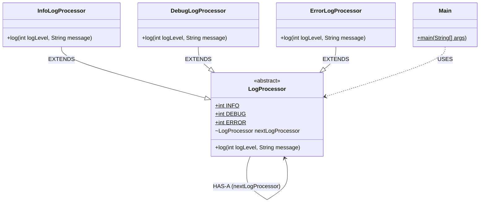

# Chain of Responsibility Pattern - Logger System

This directory contains an implementation of the **Chain of Responsibility Design Pattern** using a classic "Logger" example.

## 1. Structure & Class Diagram

The system involves an abstract `LogProcessor` class that holds a reference to the next `LogProcessor` in the chain. Concrete classes (`InfoLogProcessor`, `DebugLogProcessor`, `ErrorLogProcessor`) inherit from this and decide whether to handle a request or pass it along.

### Class Diagram (Mermaid)



## 2. Important Notes & Logic

### How it Works
1. **Chain Building**: The client (`Main`) links handlers together (e.g., `Info` -> `Debug` -> `Error`).
2. **Delegation**: When a request comes in, the first handler checks if it can process the request. If it can, it does. If it cannot (or if the design allows multiple handlers to process), it delegates the request to the `nextLogProcessor`.
3. **Decoupling**: The sender of the request only knows about the first handler in the chain. It doesn't know which specific handler eventually processes the request.

## 3. Design Principles

### Principle 1: Loose Coupling
The pattern decouples the sender of a request from its receivers. The sender only knows about the abstract `LogProcessor` reference, not which concrete `Info`, `Debug`, or `Error` class eventually handles the request.

### Principle 2: Single Responsibility Principle
Each handler class has exactly one reason to change. `InfoLogProcessor` only cares about INFO logs, etc. If we need to add a `WarningLogProcessor`, we just create a new class and insert it into the chain without modifying existing classes.

### Principle 3: Open/Closed Principle
You can introduce new handlers into the app without breaking existing client code (just add it to the chain).

## 4. Summary of Code Flow
1.  **Client** (`Main`) creates a chain: `InfoLogProcessor` pointing to `DebugLogProcessor` pointing to `ErrorLogProcessor`.
2.  **Client** calls `logObject.log(ERROR, "System out of memory exception.")`.
3.  **InfoLogProcessor** receives the call. Its `logLevel` is `ERROR` (3), which is not `INFO` (1). It passes it to `super.log()`.
4.  **LogProcessor** (super) delegates to `nextLogProcessor.log(...)` which is `DebugLogProcessor`.
5.  **DebugLogProcessor** checks `logLevel`. Not `DEBUG` (2). Passes to `super.log()`.
6.  **LogProcessor** (super) delegates to `nextLogProcessor.log(...)` which is `ErrorLogProcessor`.
7.  **ErrorLogProcessor** checks `logLevel`. It matches `ERROR` (3). It prints the error message.
8.  The chain stops.

## 5. Execution Output
```text
Sending ERROR request...
ERROR: System out of memory exception.

Sending DEBUG request...
DEBUG: Tracing SQL query execution.

Sending INFO request...
INFO: Application started successfully.
```
