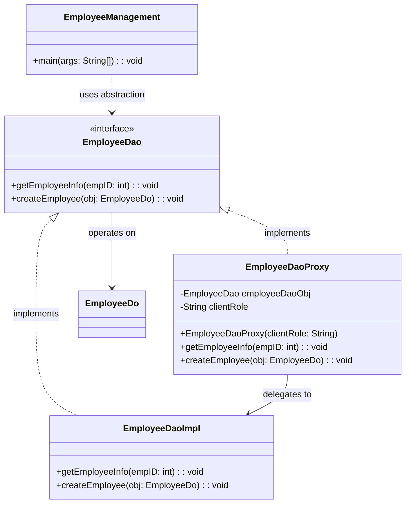

# Proxy Pattern Analysis - Employee Access Control
This directory contains an implementation of the **Proxy Pattern** (specifically, a **Protection Proxy**) for an employee management use case.

## 1. Structure & Class Diagram
The system uses a proxy (`EmployeeDaoProxy`) to control access to the real object (`EmployeeDaoImpl`) based on client role. The client depends only on the `EmployeeDao` interface.



## 2. Important Notes & Logic

### The Problem it Solves
In many systems, business operations should not be directly exposed to all callers. For example:
- `getEmployeeInfo` can be allowed to both `ADMIN` and `USER`
- `createEmployee` should be allowed only to `ADMIN`

If this access-check logic is repeated everywhere in the client layer, the code becomes hard to maintain and error-prone.

### The Solution: Protection Proxy
- `EmployeeDaoProxy` sits in front of `EmployeeDaoImpl`.
- It validates `clientRole` before forwarding requests to the real DAO.
- If access is denied, it throws an exception immediately.

This keeps business logic (real DAO) clean and keeps authorization centralized.

## 3. Design Principles

### Principle 1: Single Responsibility Principle (SRP)
- `EmployeeDaoImpl` focuses on core operations.
- `EmployeeDaoProxy` focuses on authorization checks and controlled delegation.

### Principle 2: Open-Closed Principle (OCP)
The system is open for extension:
- We can add new policies or roles by extending proxy logic.
- Client code remains unchanged because it still works through `EmployeeDao`.

### Principle 3: Dependency Inversion Principle (DIP)
Client (`EmployeeManagement`) depends on abstraction (`EmployeeDao`), not concrete classes.
Both real subject and proxy implement the same interface.

## 4. Summary of Code Flow

*   **Bootstrapping**: `EmployeeManagement` creates `EmployeeDao userProxyObj = new EmployeeDaoProxy("USER")`.
*   **Read Operation**: `getEmployeeInfo(1)` is called.
*   **Proxy Check**: Proxy allows `USER` role for read and delegates to `EmployeeDaoImpl`.
*   **Write Operation**: `createEmployee(new EmployeeDo())` is called.
*   **Proxy Check**: Proxy denies `USER` role for write and throws `RuntimeException("Access Denied!")`.

## 5. Execution Output
When running `EmployeeManagement`, expected behavior is:

```text
========= Proxy Design Pattern ==========
Fetching employee info for ID: 1
Exception in thread "main" java.lang.RuntimeException: Access Denied!
    at EmployeeDaoProxy.createEmployee(EmployeeDaoProxy.java:...)
    at EmployeeManagement.main(EmployeeManagement.java:...)
```

## 6. Tradeoffs & Potential Issues

### 1. Added Indirection
**Tradeoff**: Requests now pass through an extra layer (proxy).  
**Benefit**: Security checks are centralized and consistent.

### 2. Hardcoded Role Strings
Current implementation uses string literals (`"ADMIN"`, `"USER"`).  
In production, this should be replaced with enum/constants to avoid typos.

### 3. Exception Type
`RuntimeException` is used for simplicity.  
In a production-grade design, a custom exception (e.g., `AuthorizationException`) is cleaner.

## 7. Workflow & Thought Process

*   **Identify the Risk**: Direct access to DAO allows unauthorized operations.
*   **Introduce Subject Interface**: `EmployeeDao` defines a stable contract for both real object and proxy.
*   **Add Protection Proxy**: `EmployeeDaoProxy` wraps real object and enforces role-based checks.
*   **Keep Client Unchanged**: Client still uses `EmployeeDao`; it does not need to know if it talks to a proxy or the real object.
*   **Validate Behavior**: Run with different roles to confirm read/write access boundaries.

