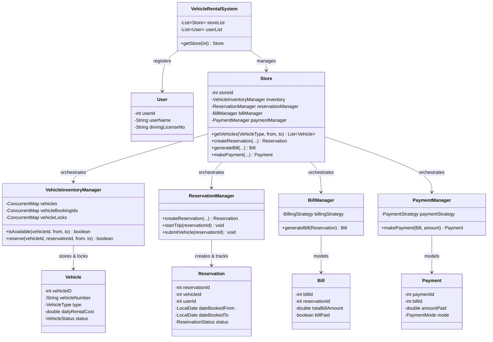

# Car Rental System - Low Level Design (LLD)

A highly scalable, production-grade Low-Level Design (LLD) simulating a Car Rental (e.g., ZoomCar, Hertz) ecosystem. This codebase is crafted for System Design interview preparation, featuring concurrency control, SOLID principles, and clean architectural separation.

## 📋 Requirements (Functional & Non-Functional)

**Functional Requirements:**
1. The system must support multiple **Stores**, each having its own location, inventory of vehicles, and reservation management.
2. Users can search for available **Vehicles** by specifying a date range and vehicle type.
3. System must allow users to **Reserve** a vehicle. 
4. Users can pick up the vehicle (Start Trip) and submit it back (End Trip).
5. Automatic **Bill generation** should take place upon returning the vehicle.
6. The system should process **Payments** using dynamically injected payment methods.

**Non-Functional Requirements:**
1. **Thread Safety & Concurrency**: Multiple users trying to book the exact same vehicle simultaneously must be handled gracefully without double-booking.
2. **Extensibility**: It must be easy to add new vehicle types, billing calculations, and payment modes without modifying existing core logic.
3. **Pluggability**: Independent stores should operate without interfering with one another.

---

## 📌 High-Level Overview & Public APIs

The project follows a Facade-driven architecture where `Store` acts as a central hub orchestrating various specialized sub-systems.

**Core Public Interfaces (API Design in Demo):**
- `VehicleRentalSystem.getStore(storeId)`: Resolves to the user's nearest/selected operational hub.
- `Store.getVehicles(VehicleType, from, to)`: Queries real-time inventory for unbooked cars.
- `Store.createReservation(vehicleId, ...)`: Blocks the car and returns a `Reservation`.
- `Store.generateBill(...)`: Computes billing post-trip.
- `Store.makePayment(...)`: Dispatches payment payload to a specialized gateway.

**Key Responsibilities by Component:**
1. **`VehicleRentalSystem`**: The highest-level manager. Maintains a directory registry of all physical Store entities and registered Users.
2. **`Store`**: A Facade unit for its area. Holds local instances of `VehicleInventoryManager`, `ReservationManager`, `BillManager`, and `PaymentManager`.
3. **`VehicleInventoryManager`**: Uses `ReentrantLock` wrappers around core entities ensuring that checking availability and reserving are executed atomically.
4. **`ReservationManager` & `BillManager`**: Lifecycle trackers that mutate the states of internal ticket models (e.g., `SCHEDULED` -> `IN_USE` -> `COMPLETED`).

---

## 🏗 Architecture & Class Diagram

---

## 🎨 Design Patterns Used

1. **Facade Pattern (`Store`)**: Exposes a simplified, cohesive UI interface (e.g., `makePayment`, `generateBill`) masking the underlying complexity of isolated managers.
2. **Strategy Pattern (`BillingStrategy`, `PaymentStrategy`)**: Allows the dynamic selection of algorithmic rules. For example, a store could use a `DailyBillingStrategy` for standard rentals and an `HourlyBillingStrategy` on busy weekends without touching core classes, substituting logic seamlessly.
3. **Repository Pattern (`ReservationRepository`)**: Separates data persistence logic from business logic domain rules for `Reservation` models.

---

## 🔒 Concurrency & Thread Safety

- **Atomic Reserving (`ReentrantLock`)**: The `VehicleInventoryManager` utilizes a map of `ReentrantLock` instances bound per `vehicleId`. When `reserve()` is called, it inherently locks only the specific vehicle, ensuring `isAvailable()` checking and the state mutation (`VehicleStatus.BOOKED`) occurs seamlessly inside a unified critical section, definitively eliminating double-booking flaws.
- **Lock-Free Read Operations**: High availability systems must read fast. Utilizing standard JDK `ConcurrentHashMap` for maps like `payments`, `vehicles`, and `bills`, ensuring multiple threads can fetch or iterate elements without waiting for blocking monitor queues. 
- **Volatile Properties**: Frequently changing status variables (like `VehicleStatus` inside `Vehicle.java`) should ideally be volatile or managed carefully across the boundary of lock blocks.

---

## 📏 SOLID Principles Analysis

1. **Single Responsibility Principle (SRP):** Extremely high adherence. `PaymentManager` ONLY deals with dispatching payment logic. `VehicleInventoryManager` solely maintains the lists of assets. `Store` orchestrates them. 
2. **Open-Closed Principle (OCP):** Introducing a new payment method (e.g., `CryptoPaymentStrategy`) just requires creating a single class implementing `PaymentStrategy`. No existing core loop evaluates `if (mode == CRYPTO)`.
3. **Liskov Substitution Principle (LSP):** Base interfaces like `PaymentStrategy` dictate exactly what `processPayment()` achieves. `UPIPaymentStrategy` can drop exactly where the interface sits, ensuring the caller operates securely.
4. **Dependency Inversion Principle (DIP):** Managers are tightly decoupled. E.g., `BillManager` depends purely on the `BillingStrategy` interface, never on concrete algorithms.

---

## 🚀 Interview Follow-ups & Scalability

1. **Transitioning to Service-Oriented (Microservices)**:
   - *Architecture*: Split the Monolith Facade into isolated network microservices (`Inventory-Service`, `Booking-Service`, `Payment-Service`). 
2. **Global Database Locking (Redis)**:
   - *Improvement*: The `ReentrantLock` only protects JVM threads. In a horizontally scaled server fleet, we must substitute JVM locks with **Distributed Locks** using Redis (e.g., `Redisson`) or ZooKeeper.
3. **Payment Gateway Fault Tolerance**:
   - *Improvement*: Web network payments fail often. Refactor `PaymentStrategy` to wrap a framework like *Resilience4j*, introducing **Exponential Backoff Retries** and **Circuit Breakers** when the underlying UPI banking system experiences brief massive packet loss outages.
4. **Dynamic Price Surging**:
   - *Feature*: Inject a `SurgePricingDecorator` that wraps the basic `BillingStrategy` and multiplies cost based on local Store capacity thresholds retrieved via `InventoryManager`.
