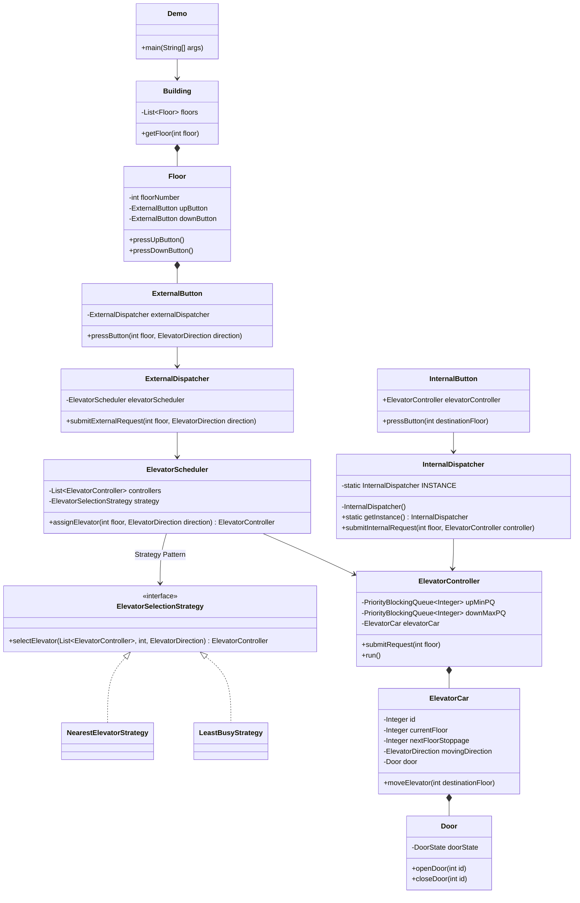

# Elevator System - Low Level Design (LLD)

This directory contains a Low-Level Design implementation of an **Elevator Tracking and Routing System** in Java. The codebase features detailed comments to serve as a revision and learning guide for system design interviews.

## 📋 Requirements (Functional & Non-Functional)

**Functional Requirements:**
1. The building contains multiple floors and multiple elevator cars.
2. Users can press an **External Button** (Up/Down) at a given floor to summon an elevator.
3. Users can press an **Internal Button** inside the elevator car to go to a specific destination floor.
4. An Elevator Controller must assign external requests to the most optimal elevator car based on an algorithm (e.g., Nearest Elevator, Least Busy).
5. The elevator car must serve queued floors efficiently tracking direction state (e.g., using Look/Scan queue paradigms).

**Non-Functional Requirements:**
1. **High Concurrency**: The hardware dispatchers will fire events asynchronously simultaneously; the controllers must process these thread-safely without deadlocking.
2. **Low Latency / Wait Time Optimization**: The routing algorithm must strive to minimize global user wait times.

## 📌 High-Level Overview & Public APIs
The system handles multiple elevators (`ElevatorCar`s) servicing multiple (`Floor`s) in a building through distinct, isolated Thread controllers.

**Core Public Interfaces (API Design):**
- `ExternalDispatcher.submitExternalRequest(floor, direction)`
- `InternalDispatcher.submitInternalRequest(floor, controller)`
- `ElevatorScheduler.assignElevator(floor, direction)` -> `ElevatorController`
- `ElevatorController.submitRequest(destinationFloor)`

**Key Responsibilities:**
1. **Internal & External Dispatches:** Users can press buttons inside the elevator (Internal Panel) to select a destination, or outside the elevator on a Floor (External Panel) to call the elevator UP or DOWN.
2. **Elevator Controller:** Each Elevator Car is managed by a dedicated controller that processes its pending destination floors using priority queues (Min PQ for UP, Max PQ for DOWN).
3. **Scheduler:** An Elevator Scheduler sits in the middle acting as a traffic controller. When an external request arrives, it utilizes a selection strategy to find the most optimal elevator to dispatch.

---

## 🏗 Architecture & Class Diagram

---

## 🎨 Design Patterns Used

1. **Strategy Pattern**
   - **`ElevatorSelectionStrategy`**: Enables switching between different mapping algorithms (`NearestElevatorStrategy`, `LeastBusyStrategy`) dynamically based on building traffic patterns without altering the scheduler.
2. **Singleton Pattern**
   - **`InternalDispatcher`**: Since internal requests are always routed directly to the specific elevator car being ridden, a singleton dispatcher is used to process all internal button presses universally.
3. **Observer/Pub-Sub Pattern (Approximated)**
   - The separation between Buttons (`ExternalButton`, `InternalButton`) and Dispatchers loosely represents a pub-sub model where button strokes simply publish events decoupled from the actual processing target.

---

## 🔒 Concurrency & Thread Safety

Multi-threading is at the core of elevator systems since requests and movement occur asynchronously.

**Thread Management:**
- Each **`ElevatorController`** implements `Runnable` and is spawned in its own dedicated `Thread`.
- Requests from external buttons (which could run on UI threads or web server threads) are enqueued safely utilizing **`PriorityBlockingQueue`**.
- It incorporates the classic **`wait()` and `notify()`** paradigm: Instead of busy-spinning when `upMinPQ` and `downMaxPQ` are empty, the controller calls `wait()` on a predefined `monitor` object, dropping to an `IDLE` state.
- Whenever a request is enqueued by `submitRequest()`, `monitor.notify()` wakes the controller thread back up.

---

## 📏 SOLID Principles Analysis

1. **Single Responsibility Principle (SRP)**: Distinct classes for specific functionalities. `ElevatorCar` strictly moves and limits scope to physical properties. `ElevatorController` solely decides the queue processing, taking the brain out of the physical car.
2. **Open-Closed Principle (OCP)**: Interfaces are utilized (`ElevatorSelectionStrategy`). We can easily inject a `VipOnlyStrategy` without altering `ElevatorScheduler`.
3. **Dependency Inversion Principle (DIP)**: `ElevatorScheduler` depends on `ElevatorSelectionStrategy` (abstraction), instead of concrete classes directly.

---

## 🚀 Interview Follow-ups & Scalability

1. **Dynamic Re-Evaluation during Sleep:**
   - *Issue*: `ElevatorCar.moveElevator()` uses `Thread.sleep(5)` synchronously inside a `for` loop, meaning the controller is blocked iterating floors and cannot proactively process a new floor that gets queued *along the way*.
   - *Fix*: Decouple physical movement from control loop. Allow `ElevatorCar` to tick floors concurrently, evaluating at each tick whether `upMinPQ` contains an intermediate floor it should pause at before proceeding to `nextFloorStoppage`.
2. **True State Design Pattern:**
   - Introduce an `ElevatorState` interface (`IdleState`, `MovingUpState`, `MovingDownState`, `DoorOpenState`). This removes complex `if-else` blocks managing logical direction mapping.
3. **Hardware Dispatch Fault Tolerance:**
   - Introduce a heartbeat mechanism for Controllers. If `Thread 2` dies or gets blocked, `ElevatorScheduler` should omit it from the selection pool.
