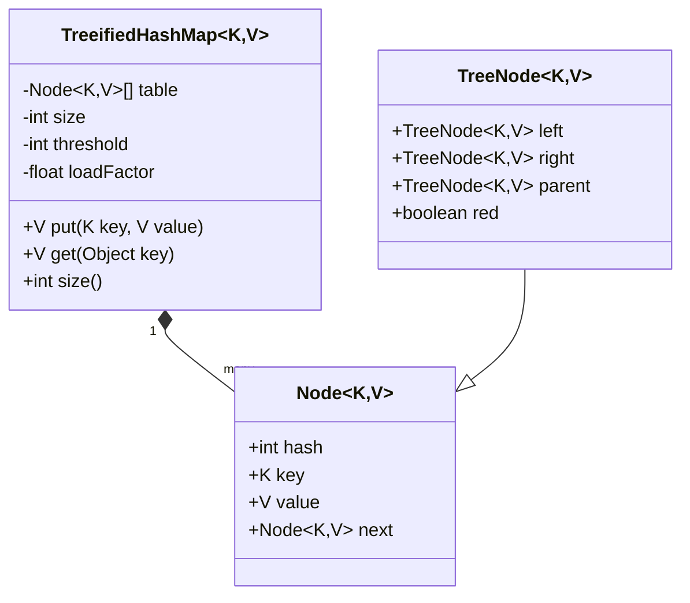

# HashMap - Low Level Design (LLD)

This directory contains an educational HashMap implementation focused on *interview-ready reasoning*:
- A minimal baseline `MyHashMap` (separate chaining).
- A more complete `TreeifiedHashMap` that demonstrates **load factor based resizing** and **bucket treeification** (treeify / untreeify concepts).
- A deep dive explanation of the `tableSizeFor()` bit trick used to choose capacity.

---

## 📋 Requirements (Functional & Non-Functional)

### Functional Requirements
1. Support `put(key, value)` and `get(key)`.
2. Handle hash collisions for different keys that map to the same bucket.
3. Keep operations fast as the number of entries grows by resizing using **load factor**.
4. When a single bucket becomes very crowded (many collisions), switch from a linked list to a tree (**treeify**).

### Non-Functional Requirements
1. Use a capacity that is a power of two to enable fast bucket indexing with a bit mask.
2. Keep the solution explainable and extendable in an interview.
3. (Important) This code is not thread-safe; concurrency is discussed under follow-ups.

---

## 📌 High-Level Overview & Public APIs

### `MyHashMap<K, V>` (Baseline)
- Collision handling: **linked list per bucket**
- Index calculation: `index = hash & (capacity - 1)`

### `TreeifiedHashMap<K, V>` (Interview-Ready)
- Collision handling:
  - Buckets start as linked lists.
  - When chain length crosses a threshold, the bucket becomes a **Red-Black tree bin** (treeified).
- Resize strategy:
  - `threshold = capacity * loadFactor`
  - if `size > threshold` => double capacity and **rehash**

Key public APIs:
- `V put(K key, V value)`
- `V get(Object key)`
- `int size()`

---

## 🏗 Architecture & Class Diagram



---

## 🔎 Analyze the Baseline Code (`MyHashMap`)

The baseline `MyHashMap` supports:
- `put`: find the bucket, then traverse the chain, update if key exists, otherwise append.
- `get`: traverse the chain and return the matching value.

### Key concepts it demonstrates
1. **Separate chaining**: every bucket is a linked list of `Entry/Node`.
2. **Capacity tuning**: it uses `tableSizeFor()` to round capacities to powers of two.

### Important bug/learning points (what we corrected)
1. Key equality must use `equals()`, not `==`.
2. Bucket indexing is better as `hash & (len - 1)` when `len` is a power of two (faster and aligns with real HashMap).
3. `hashCode()` alone may not distribute well; spreading helps reduce clustering.

---

## 📏 Deep Dive: `tableSizeFor(int cap)` (Bit Trick Explained)

Both `MyHashMap` and `TreeifiedHashMap` use the same core idea:
> Return the **smallest power of two** greater than or equal to `cap` (with safe bounds).

The code in `TreeifiedHashMap`:
```java
private static int tableSizeFor(int cap) {
    int n = cap - 1;
    n |= n >>> 1;
    n |= n >>> 2;
    n |= n >>> 4;
    n |= n >>> 8;
    n |= n >>> 16;
    return (n < 0) ? 1 : (n >= MAXIMUM_CAPACITY) ? MAXIMUM_CAPACITY : n + 1;
}
```

### Why a power of two?
Because bucket indexing becomes:
- `index = hash & (length - 1)`
This is fast and evenly distributes keys when combined with hash spreading.

### Step-by-step example: `cap = 10`
We want the smallest power of two >= 10, which is `16`.

1. `n = cap - 1 = 9`  
   Binary: `9  = 1001`
2. `n |= n >>> 1`
   - `n >>> 1 = 0100`
   - `1001 | 0100 = 1101`
3. `n |= n >>> 2`
   - `n >>> 2 = 0011`
   - `1101 | 0011 = 1111`
4. Further shifts (4, 8, 16) don’t change anything because lower bits are already all `1`s.
5. Finally `return n + 1`
   - `1111 + 1 = 1 0000 = 16`

### What the bit trick actually does
After the repeated `|=` with right shifts, the highest set bit "spreads" downward:
- Example goal: transform `1001` into `1111`
- Then adding 1 gives the next power of two.

### Handling edge cases
1. `(n < 0) ? 1 : ...`
   - Happens when `cap <= 0` causing `cap - 1` to become negative.
2. `(n >= MAXIMUM_CAPACITY) ? MAXIMUM_CAPACITY : ...`
   - Prevents overflow and enforces a maximum table size.

### Interview-ready one-liner
`tableSizeFor` rounds up to the next power of two by turning all bits below the highest set bit into `1`, then adding `1`.

---

## 🚀 How Treeification Works (Load Factor + Treeify)

### 1) Load Factor Resize Policy
In `TreeifiedHashMap`:
- `threshold = (int)(capacity * loadFactor)`
- On each successful insertion of a new key:
  - `size++`
  - if `size > threshold` => `resize()`

`resize()`:
- doubles capacity
- rehashes every existing node into the new table

### 2) Treeify Policy
We keep buckets as linked lists initially.
When inserting into a non-tree bucket:
- Count how many nodes already exist in the bucket chain (`binCount`).
- After adding the new node, if `chainLength >= TREEIFY_THRESHOLD`:
  - if `table.length >= MIN_TREEIFY_CAPACITY` => **treeify** that bucket
  - else => **resize instead of treeifying** (bucket crowding may be a capacity problem, not a hash problem)

This matches the intent of JDK HashMap thresholds:
- treeify only when the table is large enough
- otherwise, resizing is the better first fix

---

## 🧠 Easy-to-Explain HashMap Flow (Interview Walkthrough)

### `put(key, value)` flow in `TreeifiedHashMap`
1. Compute a spread hash (`h = spreadHash(key)`).
2. Map to bucket index (`i = h & (len - 1)`).
3. If bucket is empty: insert node.
4. If bucket is a linked list:
   - traverse to update if key exists
   - otherwise append
   - check if treeify conditions are met
5. If bucket is treeified:
   - insert/update in the Red-Black tree bin
6. If `size > threshold`: resize and rehash.

### `get(key)` flow
1. Compute hash and bucket index.
2. If bucket is a list: traverse and compare keys using `equals`.
3. If bucket is a tree: search the tree using `hash + tie-break ordering`.

---

## 🔒 Concurrency & Thread Safety

This implementation is designed for interview clarity, not concurrent correctness.
If you were to make it thread-safe for production:
- You would need synchronization/locks around structural changes (resize, treeify).
- Or use a concurrent map structure.

---

## 📌 SOLID Principles Analysis

1. **SRP (Single Responsibility Principle)**:
   - `resize()` only handles capacity growth + rehashing.
   - `treeifyBin()` only converts a list bin to a tree bin.
   - `putTreeVal()` only manages tree insertion/update logic.

2. **OCP (Open/Closed Principle)**:
   - Thresholds (`TREEIFY_THRESHOLD`, `MIN_TREEIFY_CAPACITY`) can be tuned without rewriting the entire algorithm.
   - The hash spreading is isolated in one method.

3. **LSP / ISP / DIP**
   - Less relevant here because we are not heavily using abstractions/interfaces, but the code still keeps responsibilities separated.

---

## 🚀 Interview Follow-ups & Scalability

1. **What about worst-case behavior?**
   - Treeification prevents extremely long linked lists and mitigates pathological collision attacks.
2. **Why not always treeify?**
   - Trees have overhead; when capacity is small, resizing often resolves the collisions cheaply.
3. **Null keys**
   - `spreadHash(null) = 0`, so null naturally maps to bucket 0.

---

## ✅ Complexity Analysis

Assuming good hashing distribution:
- `get`: O(1) average
- `put`: O(1) average, O(n) in worst case collisions

With treeified bins:
- Worst-case bucket operations improve (tree bins behave like O(log n) per bin).

---

## References / Notes
- The thresholds and `tableSizeFor()` trick follow the same ideas used in the JDK HashMap implementation.
- This repository version prioritizes clarity over production completeness.

