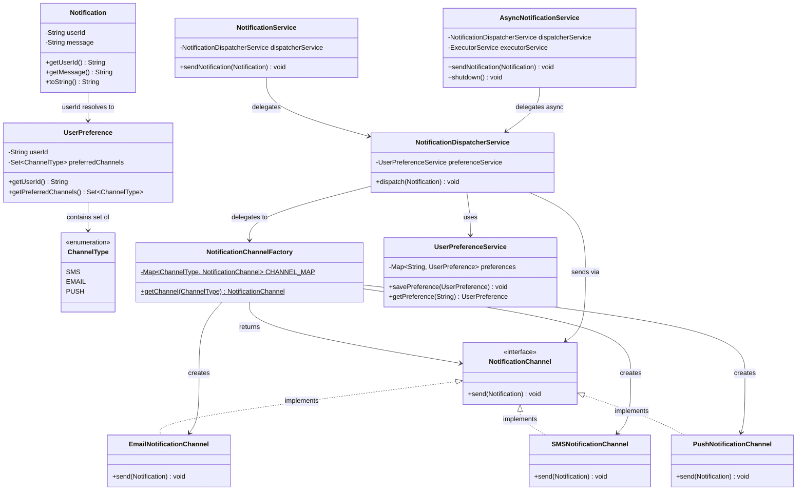

# Notification System - Low Level Design (LLD)

A production-grade Low-Level Design exercise demonstrating multi-channel notification dispatch with user preferences, async delivery, and extensible channel strategy. This codebase serves as a detailed revision guide for System Design interviews.

## 📋 Requirements (Functional & Non-Functional)

**Functional Requirements:**
1. The system must send notifications via multiple channels: **Email**, **SMS**, and **Push Notification**.
2. Delivery must respect the specific recipient's **channel preferences** (e.g., User A only wants SMS; User B wants Email + Push).
3. The system should support both **Synchronous** (blocking) and **Asynchronous** (fire-and-forget) delivery modes.
4. If a preferred channel is missing or unconfigured for a user, it should safely fall back to a default (e.g., Email).

**Non-Functional Requirements:**
1. **Fault Isolation**: An outage in the SMS provider network must absolutely not crash, skip, or delay the Email delivery loop.
2. **High Throughput / Thread-Safety**: The dispatcher engine must handle thousands of concurrent requests rapidly accessing preference caches asynchronously.
3. **Pluggability (Extensibility)**: Adding a new medium (e.g., WhatsApp or Slack) must not break core routing.

## 📌 High-Level Overview & Public APIs
The system handles dispatching messages to users via multiple mediums simultaneously and gracefully, fully isolating provider logic.

**Core Public Interfaces (API Design):**
- `NotificationService.sendNotification(Notification)`: Synchronous facade.
- `AsyncNotificationService.sendNotification(Notification)`: Returns instantly, queues payload in a Thread Pool.
- `UserPreferenceService.savePreference(UserPreference)`
- `NotificationChannel.send(Notification)`: The strict contract all providers execute.

**Key Responsibilities:**
1. **User Preferences:** Stores which channels a user has opted into (e.g., User A wants Email + Push, User B wants SMS). Defaults safely to Email if missing.
2. **Dispatcher Engine:** The `NotificationDispatcherService` acts as an orchestrator. It queries preferences, retrieves the necessary channels from a Factory, and commands them to send.
3. **Async / Sync Facades:** Exposes `NotificationService` for blocking synchronous deliveries, and `AsyncNotificationService` which offloads the heavy networking simulation calls to an `ExecutorService` thread pool.

**Code Flow:**
UserPreference is saved -> Request arrives at API facade -> Dispatcher loops over user's desired channels -> Fetches specific Sender from Factory -> Calls `send()` wrapped in a fault-tolerant try-catch block.

---

## 🏗 Architecture & Class Diagram

---

## 🎨 Design Patterns Used
1. **Strategy Pattern** 
   - **`NotificationChannel`**: Every channel (Email, SMS, Push) implements a single `send()` contract, allowing new notification modalities to be injected without touching the dispatcher engine.
2. **Factory & Flyweight Patterns**
   - **`NotificationChannelFactory`**: Decouples instantiation. Since channels don't hold conversational state, it uses an `EnumMap` as a Flyweight cache to return exactly one stateless instance per channel type, avoiding JVM object bloat under high throughput.
3. **Facade Pattern**
   - **`NotificationService`**: Hides the complex orchestration of Preference lookup and Factory delegation behind a simple, unified `sendNotification()` API endpoint for clients to interact with.

---

## 🔒 Concurrency & Thread Safety
- **Lock-Free Reads**: The `UserPreferenceService` leverages Java's `ConcurrentHashMap`, providing lock-striped writes and fully concurrent, lock-free reads. This is highly critical because `NotificationDispatcherService` continuously accesses this map concurrently from the async thread pool.
- **Data Immutability**: The `Notification` object encapsulates its variables using `final`, locking in thread-safety when data is passed across the asynchronous worker pool boundary.
- **Async Execution Lifecycle**: `AsyncNotificationService` correctly manages its internal `ExecutorService` thread pool, offering a graceful `shutdown()` hook to ensure background JVM threads don't leak or forcefully drop pending notifications during application exit.

---

## 📏 SOLID Principles Analysis
1. **Single Responsibility Principle (SRP):** Fully adhered to. `Notification` acts only as data, `UserPreferenceService` acts as a repository mapping, `EmailNotificationChannel` just knows how to send emails.
2. **Open-Closed Principle (OCP):** Adding a new channel (e.g., `WhatsAppChannel`) only requires appending it to the enum and the static Factory mapping, leaving existing dispatcher logic totally untouched. *(Can be further decoupled into 100% OCP using a Startup Registry Pattern).*
3. **Liskov Substitution Principle (LSP):** Any concrete channel (`PushNotificationChannel`) can be safely substituted for the base `NotificationChannel` interface inside the dispatcher loop without breaking behavioral correctness.
4. **Interface Segregation Principle (ISP):** The `NotificationChannel` interface mandates a single `send()` method, completely avoiding bloat and keeping implementors incredibly lean.
5. **Dependency Inversion Principle (DIP):** The dispatcher depends entirely on the abstract interfaces, not on explicit SMTP libraries or SMS SDKs.

---

## 🚀 Interview Follow-ups & Scalability
1. **Adding Resilience (Retry Decorators):**
   - *Improvement*: Wrap the `NotificationChannel` inside a `RetryableNotificationChannel` decorator. If SMTP infrastructure times out, the resilient decorator catches it and retries 3 times with exponential backoff before failing, guaranteeing robustness without dirtying the core Email logic.
2. **High-Throughput Distributed Architecture (Kafka Migration):**
   - *Improvement*: In an actual microservice environment, the in-memory JVM Async Thread Pool is insufficient and risky for crashes. We would transition to placing incoming requests onto a **Kafka Topic**. A partitioned consumer group handles distribution, allowing horizontal microservice scaling and providing a Dead Letter Queue (DLQ) for permanently failed payload messages.
3. **Throttling & Rate Limiting:**
   - *Improvement*: Introduce a Google Guava `RateLimiter` (Token Bucket algorithm) inside the dispatcher to ensure single users aren't flooded or aren't intentionally spamming the expensive external APIs (like Twilio / AWS SNS).
4. **Fault Tolerant Dispatch Routing:**
   - *Notice*: If Email fails, it guarantees not to bring down the SMS path. The per-channel `try-catch` inside the dispatcher perfectly isolates provider outages cleanly.
