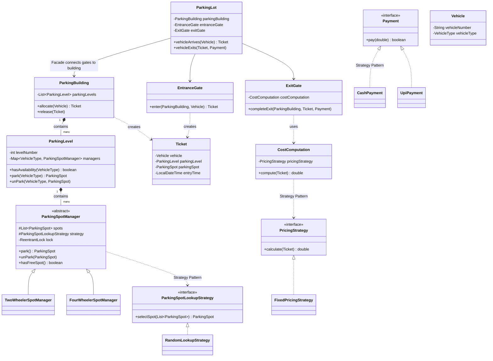

# Parking Lot - Low Level Design (LLD)

This directory contains a comprehensive Low-Level Design implementation of a **Parking Lot** system in Java. The code has been intentionally commented to serve as a learning and revision tool for LLD interviews.

## 📋 Requirements (Functional & Non-Functional)

**Functional Requirements:**
1. The parking lot should have multiple floors.
2. It should support multiple types of parking spots (e.g., Two-Wheeler, Four-Wheeler).
3. It must support multiple entry and exit gates.
4. It should assign a ticket to a vehicle upon entry.
5. It should collect payment and calculate fees based on a pricing strategy upon exit.
6. The system should allocate parking spots dynamically using a defined strategy (e.g., Random, Nearest-First).

**Non-Functional Requirements:**
1. **Thread-Safety & Concurrency**: The system must flawlessly handle concurrent requests from multiple entry and exit gates without double-booking spots.
2. **Scalability**: It should easily accommodate new vehicle and spot types without massive structural refactors.

## 📌 High-Level Overview & Public APIs
The Parking Lot system delegates physical space management to `ParkingLevel`s and specific logic to `ParkingSpotManager`s. 

**Core Public Interfaces (API Design):**
- `EntranceGate.enter(ParkingBuilding, Vehicle)` -> `Ticket`
- `ParkingBuilding.allocate(Vehicle)` -> `Ticket`
- `ExitGate.completeExit(ParkingBuilding, Ticket, Payment)`
- `ParkingBuilding.release(Ticket)`

**Key Responsibilities:**
1. **Entrance**: A vehicle arrives, the system allocates the correct spot type using a specific lookup strategy, and issues a `Ticket`.
2. **Parking Limits**: Handles multi-level parking and segregates spots by vehicle type using distinct Spot Managers.
3. **Exit**: When the vehicle leaves, the system calculates the fee using a pricing strategy, processes the payment using a payment strategy, and frees up the spot for future vehicles.

---

## 🏗 Architecture & Class Diagram

The following Mermaid Class Diagram visualizes the structural relationships, dependencies, and inheritances within the parking lot system.

---

## 🎨 Design Patterns Used

1. **Strategy Pattern** 
   - **`ParkingSpotLookupStrategy`**: Enables switching between different ways to find a free spot (e.g., `RandomLookupStrategy`, `NearestToElevatorStrategy`, etc.) without altering the core `ParkingSpotManager`.
   - **`PricingStrategy`**: Allows decoupling the fixed price logic (`FixedPricingStrategy`) from other potential pricing structures (e.g., `HourlyPricingStrategy`, `DynamicSurgePricingStrategy`).
   - **`Payment`**: Isolates different payment modes (`CashPayment`, `UpiPayment`) so that `ExitGate` doesn't need to know the internal workings of transaction processing.
   
2. **Facade Pattern**
   - **`ParkingLot`**: Acts as a simplified interface for the end-user (or the client code). Instead of a client manually invoking the `ParkingBuilding`, `EntranceGate`, and `ExitGate`, they simply interact with `ParkingLot` which internally choreographs the flow.

3. **Factory Methods / Abstract Manager logic**
   - **`ParkingSpotManager`**: Contains the boilerplate code for handling thread safety and spot searching, letting subclasses like `TwoWheelerSpotManager` naturally inherit these traits and deal with specifics.

---

## 🔒 Concurrency & Thread Safety

Multi-threading is critical in a real-world parking lot (e.g., multiple gates allowing cars to enter simultaneously). If two entrance gates try to allocate the same parking spot to two different vehicles simultaneously, a **Race Condition** occurs.

**How it's handled here:**
- We utilize `ReentrantLock(true)` inside the abstract `ParkingSpotManager`. 
- By passing `true` into the constructor, we establish a **Fair Lock**, meaning threads (gates) waiting the longest get access first. This prevents starvation of threads under heavy load.
- Critical sections (checking availability `hasFreeSpot()`, occupying a spot `park()`, releasing a spot `unPark()`) are safely locked and released under a `try/finally` block to prevent Deadlocks in case an exception occurs midway.

---

## 📏 SOLID Principles Analysis

1. **Single Responsibility Principle (SRP)**: Adhered to. Every logic has its own class. `EntranceGate` just worries about entry, `ExitGate` worries about exit, `CostComputation` calculates the price, and Entities just hold data.
2. **Open-Closed Principle (OCP)**: Heavily utilized through interfaces (`PricingStrategy`, `Payment`, `ParkingSpotLookupStrategy`). We can add a `CardPayment` class without touching the existing `ExitGate` logic.
3. **Liskov Substitution Principle (LSP)**: Adhered to. `TwoWheelerSpotManager` can seamlessly replace the abstract `ParkingSpotManager`.
4. **Interface Segregation Principle (ISP)**: Adhered to. Interfaces are succinct. The `Payment` interface only mandates `pay(amount)`, keeping implementors free from unused baggage methods.
5. **Dependency Inversion Principle (DIP)**: Components depend on abstractions, not concretions. `ExitGate` depends on the `Payment` interface provided to it at runtime, not on a specific `CashPayment` class.

---

## 🚀 Interview Follow-ups & Scalability

While this is a robust design, for a highly scalable production system, we could enhance:
1. **Dynamic Pricing Integration**: Implement an `HourlyPricingStrategy` that uses `Duration.between(ticket.getEntryTime(), LocalDateTime.now())` to calculate time spent, and multiply by a dynamic rate from the DB.
2. **Distributed Locking / DB Transactions**: In a multi-server deployment (e.g. Microservices), an in-memory `ReentrantLock` isn't enough. We would need a distributed lock (like Redis Redisson) or handle it at the Database layer using Optimistic/Pessimistic locking or `SELECT ... FOR UPDATE`.
3. **Vehicle and Ticket Interfaces**: Abstraction could be pushed further if we had deeply distinct behaviors—like an Electric Vehicle needing charging spots.
4. **Decoupling Client Setup**: The `ParkingLotClient` is currently doing very heavy setup (creating lists, maps, building the hierarchy manually). Using a Dependency Injection framework like **Spring Boot** (@Service, @Component) or a dedicated `ParkingLotFactory` / `Builder` would clean up the client instantiation code immensely.
