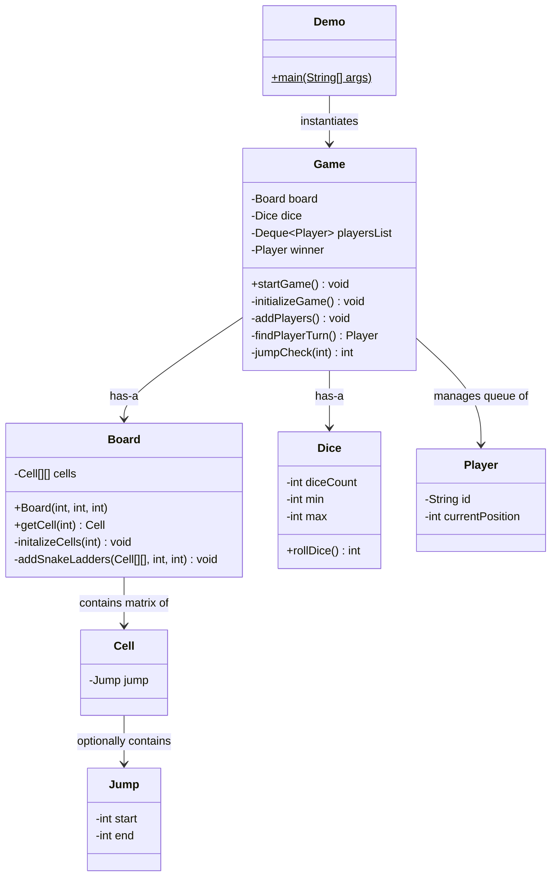

# Snake and Ladder Game - Low Level Design (LLD)

A fully functional, object-oriented Low-Level Design (LLD) implementation of the classic Snake and Ladder game. This codebase includes handling for complex edge cases (like chained jumps) and serves as an excellent revision guide for System Design interviews.

## 📋 Requirements (Functional & Non-Functional)

**Functional Requirements:**
1. The game must support a configurable board size (e.g., 10x10 = 100 cells).
2. The game must support a configurable number of snakes and ladders, placed randomly without overlapping.
3. Multiple players must be able to play the game on a taking-turns basis using a queue (Deque).
4. The system must process dice rolls accurately to move players.
5. If an entity (snake or ladder) is encountered, the player jumps to the target destination. If jumps are chained (e.g., ladder lands on snake), the system must process them sequentially until landing on a safe cell.
6. A player must land *exactly* on the final square to win.

**Non-Functional Requirements:**
1. **Extensibility**: It must be easy to add new entities (like Frogs or Magic Portals) without breaking existing traversal logic.
2. **Robustness**: The game loop must handle edge cases where a dice roll would send the player out of bounds, preventing invalid moves.

## 📌 High-Level Overview & Public APIs
The system operates through an orchestrated `Game` engine that initializes the playing environment and controls the action loop.

**Core Entities & Responsibilities:**
1. **Board Management (`Board`, `Cell`, `Jump`)**: Generates the grid, validates the randomized placement of snakes (going down) and ladders (going up).
2. **Game Mechanics (`Dice`, `Player`)**: Generates secure random dice rolls using `ThreadLocalRandom` and maintains player state.
3. **Dispatcher Engine (`Game`)**: The central loop orchestrator. Retrieves players from a Deque, handles the dice roll, validates the jump mechanics, and checks for winning conditions.

## 🏗 Architecture & Class Diagram

## 🎨 Design Patterns Used
While this specific implementation relies heavily on standard Object-Oriented Principles, the architecture leaves room for patterns:
1. **Strategy Pattern (Potential)**: The standard dice logic could be abstracted into a `DiceRollingStrategy` to allow for loaded dice, dual dice, or specialized probability algorithms.
2. **Factory Pattern (Potential)**: `BoardFactory` could be used to instantiate different types of boards (e.g., hexagonal boards, circular boards) rather than binding logic into the Board constructor.

## 📏 SOLID Principles Analysis
1. **Single Responsibility Principle (SRP):** Adhered to. `Jump` just stores coordinates, `Dice` just generates numbers, `Player` holds state, and `Board` initializes the grid.
2. **Open-Closed Principle (OCP):** New jumps (like teleportation portals) can easily be added by utilizing the generic `Jump` class without changing `Board` setup parameters heavily.
3. **Dependency Inversion Principle (DIP):** Currently, the system builds concrete components directly in `Game.initializeGame()`. In a fully scalable enterprise system, `Board` and `Dice` would be injected into `Game` via Dependency Injection.

## 🚀 Interview Follow-ups & Scalability
1. **Handling Infinite Loops:**
   - *Improvement:* If an interviewer asks "What if a ladder takes you to a snake, which takes you back to the ladder?", the current `while` loop would run infinitely. We would need a `Set<Integer> visitedCells` inside `jumpCheck` to break out or declare the move invalid if a cycle is detected.
2. **Multiplayer Scalability / DB Storage:**
   - *Improvement:* To scale to millions of concurrent ongoing games online, the `Game` state cannot live in JVM memory. The `Deque<Player>` and `Board` layout would be serialized and pushed to a NoSQL datastore (like Redis or DynamoDB), with stateless worker engines processing the dice rolls via HTTP requests.
