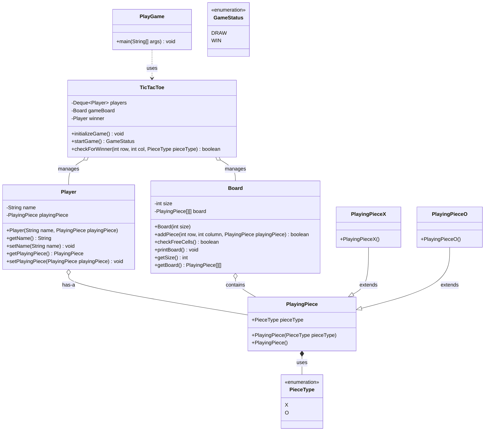

# Tic Tac Toe - Low Level Design (LLD)

Welcome to the **TicTacToe** game implementation in Java! This project serves as a practical demonstration of Object-Oriented Programming (OOP) principles and low-level design patterns.

## 📋 Requirements (Functional & Non-Functional)

**Functional Requirements:**
1. The game must be played between exactly 2 players.
2. The game should be played on an $N \times N$ grid.
3. Players take turns executing moves.
4. A move consists of choosing an empty cell and placing the player's assigned symbol (X or O).
5. The game ends when a player forms a continuous horizontal, vertical, or diagonal line of size $N$, resulting in a WIN.
6. If the board is full and no continuous line is formed, the game is a DRAW.

**Non-Functional Requirements:**
1. **Latency (O(1) Win Checking preferred)**: The win condition evaluation should be structurally optimized.
2. **Extensibility**: The system should not break if the board size grows or new symbols are introduced.

## 📌 High-Level Overview & Public APIs
This application is a console-based, two-player TicTacToe game. It simulates turn-based flow using a Double-Ended Queue (Deque) and separates rendering from game logic.

**Core Public Interfaces (API Design):**
- `TicTacToe.initializeGame()`: Spawns the N-size board and players.
- `TicTacToe.startGame()` -> `GameStatus`: The main game loop trigger.
- `Board.addPiece(row, col, PlayingPiece)`: Executes a validated move onto the memory grid.
- `Board.checkFreeCells()`: Returns true if the game can continue.

**Key Responsibilities:**
1. **`TicTacToe.java` (Engine):** Configures the 3x3 board, initializes players, manages alternating turns via a `Deque`, and contains the O(N) win-checking logic scanning rows, columns, and diagonals.
2. **`Board.java`:** Encapsulates the 2D grid (`PlayingPiece[][]`), exposing safe methods to add pieces, verify free cells, and print the visual state.
3. **Models:** `Player` holds participant bindings, while `PlayingPiece` (and its concrete X/O versions) leverage enums for type safety.

---

## 🏗 Architecture & Class Diagram

---

## 🎨 Design Patterns Used
1. **Factory Method (Potential):** While currently instantiated directly, the `PlayingPiece` architecture is set up perfectly for a factory pattern to dynamically provision 'X' or 'O' pieces based on user choice.
2. **Strategy / Enum Singleton:** `PieceType` and `GameStatus` utilize Enums to ensure robust, type-safe constant state tracking across the application, preventing invalid raw string or integer entries.

---

## 🔒 Concurrency & Thread Safety
**Console Single-Threaded:** Natively, this is a local console application running sequentially on the `main` thread. There are no race conditions since standard input strictly blocks execution until a user finishes their physical turn.

**Server Adaptation:** If adapted into a Web Socket multiplayer server, `TicTacToe` would require synchronization. Two players sending moves simultaneously would cause a race condition on the `PlayingPiece[][]` addition and `Deque` rotation. We would introduce a `ReentrantLock` around the `addPiece` and turn management logic to serialize incoming moves safely.

---

## 📏 SOLID Principles Analysis
1. **Single Responsibility Principle (SRP):** Adhered to. `Board` strictly manages cell storage/printing. `Player` only holds identity. `TicTacToe` handles the game rules and routing.
2. **Open-Closed Principle (OCP):** Polymorphism via `PlayingPiece` allows new piece types (e.g., custom symbols in a generic board game) to be added without touching the `Board`'s internal array containment logic.
3. **Dependency Inversion Principle (DIP):** `Board` relies on the abstract `PlayingPiece` reference rather than concretions like `PlayingPieceX` or `PlayingPieceO`.

---

## 🚀 Interview Follow-ups & Scalability
1. **O(1) Win Checking:**
   - *Current State*: `checkForWinner` iterates over the entire row, column, and diagonals after every move (O(N) time complexity, where N is board size).
   - *Fix*: Keep tracking arrays `int[] rowCount`, `int[] colCount`, `int diagCount`, `int antiDiagCount`. When Player 1 plays, increment; when Player 2 plays, decrement. If any counter hits `+N` or `-N`, someone won in O(1) time.
2. **Input Validation & Exception Handling:**
   - *Current State*: `Scanner` fails horribly if players input letters instead of integer coordinates.
   - *Fix*: Wrap the `Scanner` input in a robust `try-catch` block loop to handle missing commas or letter inputs (preventing `NumberFormatException` / `ArrayIndexOutOfBoundsException`).
3. **Decouple I/O (Presentation Layer):**
   - Introduce an `IOHandler` interface to sever the `System.out.println` console dependency inside the engine, making the backend engine purely logic-driven and ready for UI porting.
