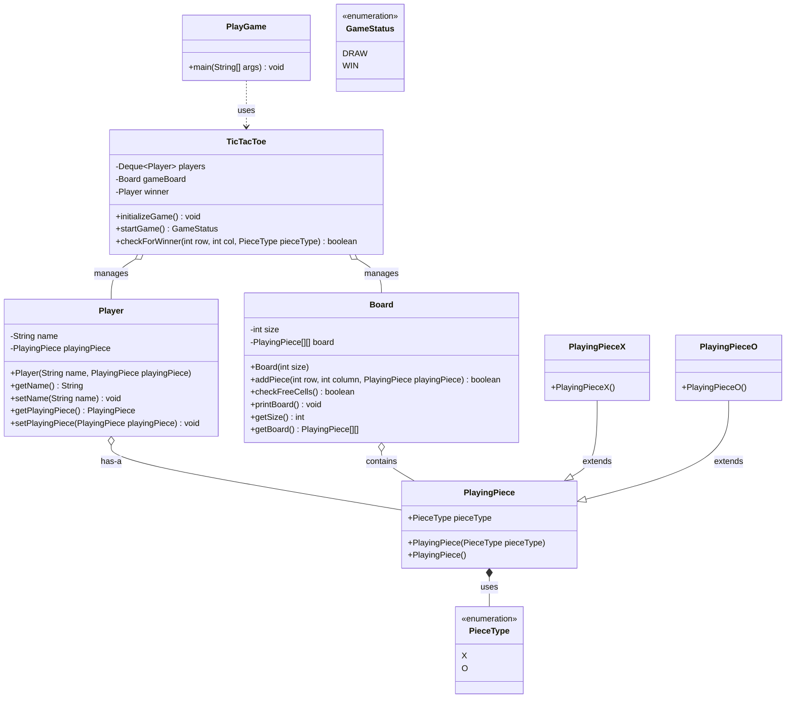

# TicTacToe Low-Level Design (LLD)

Welcome to the **TicTacToe** game implementation in Java! This project serves as a practical demonstration of Object-Oriented Programming (OOP) principles and low-level design patterns.

## 📖 Deep Dive: How It Works

This application is a console-based, two-player TicTacToe game. The primary flow coordinates between the Game Engine (`TicTacToe` class), the visual Board (`Board` class), and the active entities (`Player` and `PlayingPiece` classes).

### Core Components

1. **`PlayGame.java`**
   - **Role**: The application entry point.
   - **Responsibility**: It simply bootstaps the game, instantiates the `TicTacToe` engine, calls `initializeGame()`, and starts the game loop. Finally, it parses the `GameStatus` enum returned to print out whether a player won or if it was a draw.

2. **`TicTacToe.java`**
   - **Role**: The main Game Controller / Engine.
   - **Responsibility**: 
     - **Setup**: Configures a 3x3 board and initializes two players, one with `PieceType.X` and the other with `PieceType.O`.
     - **Turn Management**: Uses a `Deque<Player>` (specifically an `ArrayDeque`). The player at the front is dequeued to take their turn. Once a valid move is made, they are enqueued at the back (`offerLast`), effectively alternating turns.
     - **Win Logic**: Contains `checkForWinner()`, which scans the row, column, main diagonal, and anti-diagonal of the last played move to determine if a player has aligned 3 pieces.

3. **`Board.java`**
   - **Role**: State storage and visual representation.
   - **Responsibility**: Manages a 2D array grid (`PlayingPiece[][] board`). It exposes methods to add a piece (`addPiece`), check if the board is full (`checkFreeCells`), and beautifully prints the grid in the console (`printBoard`).

4. **Models (`org.example.model.*`)**
   - **`Player`**: Encapsulates player details, holding their name and what piece they are using.
   - **`PlayingPiece`**: A base class for game pieces.
   - **`PlayingPieceX` / `PlayingPieceO`**: Concrete classes extending `PlayingPiece` for specific types.
   - **`PieceType`**: An Enum distinguishing 'X' vs 'O'.
   - **`GameStatus`**: An Enum representing the final terminal state (`WIN` or `DRAW`).

---

## 🛠️ Design Patterns & OOP Principles Used

- **Encapsulation**: The `Board` class encapsulates the 2D array and controls how pieces are added, preventing external classes from illegally modifying the grid directly.
- **Inheritance & Polymorphism**: `PlayingPieceX` and `PlayingPieceO` extend the base `PlayingPiece` class. The `Board` only needs to know about `PlayingPiece`, allowing it to handle any piece type polymorphismly.
- **Queue for Turn Management**: Using a `Deque` (Double-Ended Queue) for turn assignments is an excellent pattern for multiplayer games. It elegantly handles "next turn" logic without complex if-else or boolean toggles.
- **Enums for Type Safety**: `PieceType` and `GameStatus` utilize Enums to ensure robust, type-safe constant values instead of relying on raw strings or integers, avoiding accidental typos.

---

## 📊 Class Diagram (Mermaid)

Below is the class diagram illustrating the relationships and hierarchy between the components:

---

## 🚀 Potential Improvements & Refactoring

While this design works well for a standard TicTacToe game, here are some thoughts on how it could be scaled or improved:

1. **O(1) Win Checking**:
   - ***Current State***: `checkForWinner` iterates over the entire row, column, and diagonals (O(N) time complexity, where N is board size).
   - ***Improvement***: Keep tracking arrays `int[] rowCount`, `int[] colCount`, `int diagCount`, `int antiDiagCount`. When Player 1 plays, increment; when Player 2 plays, decrement. If any value reaches `+N` or `-N`, someone won in O(1) time.

2. **Input Validation & Exception Handling**:
   - ***Current State***: Using `Scanner` parsing raw strings separated by commas (`values[0]`, `values[1]`). Entering letters or missing commas causes an unhandled `NumberFormatException` or `ArrayIndexOutOfBoundsException`, crashing the game.
   - ***Improvement***: Wrap the scanner input in a robust `try-catch` block inside a while loop until valid integer input represents an empty, within-bounds grid cell.

3. **Factory Design Pattern**:
   - ***Current State***: `TicTacToe` tightly couples with `PlayingPieceX` and `PlayingPieceO` during `initializeGame()`.
   - ***Improvement***: Use a `PlayerFactory` to dynamically provision players and inject their piece types, making the game easily extensible to N-players with custom symbols.

4. **Decouple I/O**:
   - ***Current State***: `System.out.print` and `Scanner input` are heavily mixed with core game logic in `TicTacToe` and `Board`.
   - ***Improvement***: Introduce an interface like `GameView` or `IOHandler`. This separates logic from presentation, making it possible to convert this terminal game into a Web or GUI game without changing the `TicTacToe` engine.
