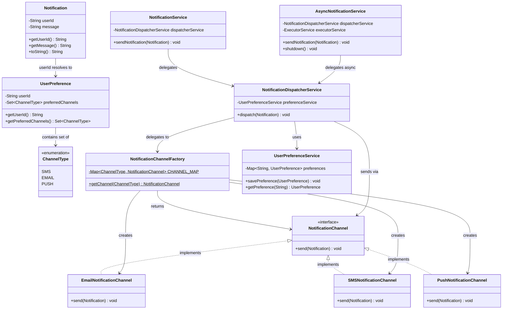

# 🔔 Notification System — LLD Deep Dive

> **A production-grade Low-Level Design exercise demonstrating multi-channel notification dispatch with user preferences, async delivery, and extensible channel strategy.**

---

## 📑 Table of Contents

1. [Problem Statement](#-problem-statement)
2. [Architecture Overview](#-architecture-overview)
3. [Class Diagram](#-class-diagram-mermaid)
4. [Package Structure](#-package-structure)
5. [Component Breakdown](#-component-breakdown)
6. [Design Patterns Used](#-design-patterns-used)
7. [SOLID Principles — Analysis](#-solid-principles--analysis)
8. [Flaws Found & Fixes Applied](#-flaws-found--fixes-applied)
9. [How It's Scalable](#-how-its-scalable)
10. [Code Flow — Step by Step](#-code-flow--step-by-step)
11. [Execution Output](#-execution-output)
12. [LLD Interview Q&A](#-lld-interview-qa)
13. [What's Missing for Production](#-whats-missing-for-production)

---

## 🎯 Problem Statement

Design a **Notification System** that:
- Sends notifications to users via multiple channels: **Email, SMS, Push**
- Respects each user's **channel preferences** (e.g., user A wants Email + Push; user B wants SMS only)
- Supports both **synchronous** and **asynchronous** delivery
- Is **extensible** — adding a new channel (e.g., WhatsApp) should require minimal change
- Is **resilient** — one failing channel must **not** block others

---

## 🏗 Architecture Overview

```
┌──────────────────────────────────────────────────────────────────────┐
│                         API Layer (Facade)                           │
│    NotificationService (sync)   AsyncNotificationService (async)     │
└───────────────────────────────┬──────────────────────────────────────┘
                                │ delegates to
                                ▼
┌──────────────────────────────────────────────────────────────────────┐
│                    NotificationDispatcherService                     │
│  1. Look up UserPreference → 2. Get channel(s) → 3. send() each     │
└───────────┬──────────────────────────────────┬───────────────────────┘
            │ queries                          │ creates/fetches via
            ▼                                  ▼
┌───────────────────────┐       ┌──────────────────────────────────┐
│  UserPreferenceService│       │   NotificationChannelFactory     │
│  (in-memory store)    │       │   (Static Flyweight Factory)     │
└───────────────────────┘       └──────┬───────────┬──────────────┘
                                       │           │
                          ┌────────────┘           └────────────────┐
                          ▼                                         ▼
               ┌──────────────────┐                 ┌──────────────────────┐
               │ EmailChannel     │  . . .          │ PushChannel          │
               │ SMSChannel       │                 │ (FCM/APNs in prod)   │
               └──────────────────┘                 └──────────────────────┘
```

---

## 📐 Class Diagram (Mermaid)



---

## 📁 Package Structure

```
src/main/java/org/example/
├── Main.java                              ← Entry point / demo
├── model/
│   ├── ChannelType.java                  ← Enum: SMS | EMAIL | PUSH
│   ├── Notification.java                 ← Value Object (immutable)
│   └── UserPreference.java               ← User's channel preferences
├── channel/
│   ├── NotificationChannel.java          ← Strategy Interface
│   ├── EmailNotificationChannel.java     ← EMAIL implementation
│   ├── SMSNotificationChannel.java       ← SMS implementation
│   └── PushNotificationChannel.java      ← PUSH implementation
├── factory/
│   └── NotificationChannelFactory.java   ← Flyweight Factory
├── service/
│   ├── UserPreferenceService.java        ← Preference CRUD
│   └── NotificationDispatcherService.java← Routing & dispatch
└── api/
    ├── NotificationService.java          ← Sync Facade
    └── AsyncNotificationService.java     ← Async Facade + thread pool
```

---

## 🔍 Component Breakdown

### `Notification` (Model / Value Object)
The data bag for a single notification. Contains `userId` and `message`.
- Fields must be **`final`** (immutable) — notifications are shared across threads via async dispatch.
- Add `notificationId`, `type`, `timestamp`, `priority` for production.

---

### `UserPreference` (Model)
Stores which channels the user wants.
- Backed by a `Set<ChannelType>` — no duplicates.
- Returns an **unmodifiable view** to prevent external mutation (encapsulation).
- Default fallback in the service is `EMAIL` if no preference found.

---

### `NotificationChannel` (Interface — Strategy)
The core abstraction. Every concrete channel implements exactly one method: `send(Notification)`.

| Channel | Concrete Class | Production Tech |
|---------|----------------|----------------|
| EMAIL | `EmailNotificationChannel` | JavaMailSender / SES |
| SMS   | `SMSNotificationChannel`   | Twilio / AWS SNS |
| PUSH  | `PushNotificationChannel`  | FCM / APNs |

---

### `NotificationChannelFactory` (Factory + Flyweight)
Creates and **caches** channel instances in a static `EnumMap`.
- Channels are **stateless** → safe to share a single instance.
- `EnumMap` is faster and more memory-efficient than `HashMap` for enum keys.

---

### `UserPreferenceService` (Repository-like Service)
Stores preferences in `ConcurrentHashMap` (thread-safe, no locks needed for reads).

---

### `NotificationDispatcherService` (Orchestrator)
Core routing logic:
1. Resolve user preferences
2. Get channel per type from factory
3. Call `send()` on each channel inside a **try-catch** (one failure ≠ all fail)

---

### `NotificationService` (Sync Facade) & `AsyncNotificationService` (Async Facade)
Two API entry points:
- **Sync** — caller waits for all channels to complete
- **Async** — submit to `ExecutorService`, caller returns immediately

---

## 🧩 Design Patterns Used

| Pattern | Where | Why |
|---------|-------|-----|
| **Strategy** | `NotificationChannel` interface | Each channel is an interchangeable algorithm for delivering a notification |
| **Factory** | `NotificationChannelFactory` | Decouples channel creation from the dispatcher |
| **Flyweight** | Pre-instantiated `CHANNEL_MAP` in factory | Stateless channels are shared — avoids creating thousands of short-lived objects |
| **Facade** | `NotificationService` & `AsyncNotificationService` | Clean public API hiding internal dispatcher complexity |
| **Template Method** (potential) | Each channel's `send()` | Could add pre/post hooks (logging, retry) without changing implementations |

---

## ✅ SOLID Principles — Analysis

### S — Single Responsibility Principle ✅
| Class | Responsibility |
|-------|----------------|
| `Notification` | Hold notification data only |
| `UserPreference` | Hold preference data only |
| `UserPreferenceService` | CRUD for preferences |
| `NotificationDispatcherService` | Route notification to channels |
| `EmailNotificationChannel` | Send via Email ONLY |
| `NotificationChannelFactory` | Create/cache channels |
| `AsyncNotificationService` | Manage async thread pool |

Each class has exactly **one reason to change**. ✅

---

### O — Open/Closed Principle ⚠️ Partial

**✅ Open for extension:**
Adding a new channel (e.g., WhatsApp):
1. Create `WhatsAppNotificationChannel implements NotificationChannel`
2. Add `ChannelType.WHATSAPP` to the enum
3. Register in `NotificationChannelFactory`

**⚠️ Closed for modification?** Not fully — the factory `CHANNEL_MAP` and `ChannelType` enum must change.

**💡 True OCP Solution: Registry Pattern**
```java
// Instead of hardcoded static init block:
NotificationChannelFactory.register(ChannelType.WHATSAPP, new WhatsAppChannel());
// Each channel module self-registers → factory never changes
```

---

### L — Liskov Substitution Principle ✅
Any `NotificationChannel` implementation can replace any other without breaking the dispatcher.
`dispatcher.send(emailChannel)` and `dispatcher.send(smsChannel)` are interchangeable. ✅

---

### I — Interface Segregation Principle ✅
`NotificationChannel` has exactly **one method**: `send(Notification)`.
No channel is forced to implement methods it doesn't need. ✅

---

### D — Dependency Inversion Principle ✅ / ⚠️
**✅ Good:** `NotificationDispatcherService` depends on `NotificationChannel` interface, not concrete classes.

**⚠️ Partially violated:** `NotificationDispatcherService` calls `NotificationChannelFactory.getChannel()` — a static method call. Static calls are harder to mock in unit tests.

**💡 Fix:** Inject the factory (or a `ChannelRegistry` interface) via constructor instead of calling static methods directly.

---

## 🐛 Flaws Found & Fixes Applied

| # | Flaw | Severity | Fix Applied |
|---|------|----------|-------------|
| 1 | `Notification` fields were mutable (no `final`) | 🔴 High | Added `final` → immutability guaranteed for thread safety |
| 2 | `UserPreference` exposed internal mutable `Set` | 🔴 High | Wrapped in `Collections.unmodifiableSet()` |
| 3 | Factory called `new XChannel()` on every dispatch | 🟡 Medium | Pre-instantiated in `EnumMap` (Flyweight) |
| 4 | One channel failure broke the whole dispatch loop | 🔴 High | Per-channel `try-catch` so failures are isolated |
| 5 | `AsyncNotificationService` had no thread pool shutdown | 🔴 Critical | Added `shutdown()` + JVM shutdown hook |
| 6 | `Main` registered prefs for `"user"` but sent to `"user1"` | 🟡 Medium | Fixed userId to match |
| 7 | `Main` dispatched the same notification **twice** | 🟡 Medium | Removed duplicate direct `dispatcher.dispatch()` call |
| 8 | Duplicate file: `notificationChannel.java` (lowercase) existed alongside `NotificationChannel.java` | 🟠 High | Flag for deletion (dead code / compile confusion) |
| 9 | Factory method named `getChannelType()` — misleading | 🟢 Low | Renamed to `getChannel()` |
| 10 | No null/empty guards on `UserPreference` constructor | 🟡 Medium | Added validation with `IllegalArgumentException` |

---

## 📈 How It's Scalable

### Horizontal Scaling
| Layer | Strategy |
|-------|----------|
| API Facade | Expose as REST endpoints → scale with multiple instances behind a load balancer |
| Preference Store | Replace `ConcurrentHashMap` with Redis / DynamoDB for shared state across instances |
| Dispatcher | Stateless → easily horizontally scalable |
| Channels | Each can call an external provider independently; can be throttled per provider |

### Adding New Channels
```
1. Add ChannelType.WHATSAPP to the enum
2. Create WhatsAppNotificationChannel implements NotificationChannel
3. Register in NotificationChannelFactory static block (or use registry)
→ Zero changes to Dispatcher, Preference, or API layers
```

### High-Throughput Pattern (Production)
```
REST Controller
       │
       ▼
Kafka Producer (notification events)
       │
       ▼
Kafka Consumer Group (multiple consumers)
       │
       ▼
NotificationDispatcherService
       │
  ┌────┴─────┐
  ▼          ▼
Email      SMS / Push   (each channel on separate worker)
```
- **Kafka** provides durability, replay, and back-pressure
- Consumer group allows horizontal scaling
- Dead Letter Queue for failed messages

---

## 🔄 Code Flow — Step by Step

```
1️⃣  User saves preference:
    userPreferenceService.savePreference(new UserPreference("user1", {EMAIL, PUSH}))
    → Stored in ConcurrentHashMap["user1" → {EMAIL, PUSH}]

2️⃣  Notification created:
    new Notification("user1", "Your order has been delivered!")

3️⃣  NotificationService.sendNotification(notification)
    → delegates to NotificationDispatcherService.dispatch(notification)

4️⃣  Dispatcher looks up preferences:
    UserPreference pref = preferenceService.getPreference("user1")
    → pref.getPreferredChannels() = {EMAIL, PUSH}

5️⃣  For each channel type {EMAIL, PUSH}:
    a. NotificationChannelFactory.getChannel(EMAIL) → returns cached EmailChannel
    b. emailChannel.send(notification)     → prints [EMAIL] → ...
    c. NotificationChannelFactory.getChannel(PUSH)  → returns cached PushChannel
    d. pushChannel.send(notification)      → prints [PUSH] → ...

6️⃣  (Async path): task submitted to ExecutorService thread pool
    → main thread returns immediately; worker thread runs steps 4-5
```

---

## 🖥 Execution Output

```
=== Synchronous Send ===
[EMAIL] → User: user1 | Message: Hi, Your order has been delivered!
[PUSH]  → User: user1 | Message: Hi, Your order has been delivered!

=== Asynchronous Send ===
[EMAIL] → User: user1 | Message: Hi, Your order has been delivered!   (on worker thread)
[PUSH]  → User: user1 | Message: Hi, Your order has been delivered!   (on worker thread)

=== Unknown User (falls back to EMAIL default) ===
[EMAIL] → User: unknownUser | Message: You have a new message!

[AsyncNotificationService] Initiating graceful shutdown...
[AsyncNotificationService] Shutdown complete.
```

---

## 🎤 LLD Interview Q&A

**Q1: Why use an interface (`NotificationChannel`) instead of an abstract class?**
> An interface enforces a contract without dictating inheritance. A channel can already extend another class (e.g., a base retryable sender). Using an interface keeps design open (multiple inheritance of type). Also respects ISP — interface stays minimal.

---

**Q2: Why `ConcurrentHashMap` in `UserPreferenceService`?**
> `NotificationDispatcherService` can be called from multiple threads simultaneously (e.g., via the async pool). `HashMap` is not thread-safe — concurrent reads+writes can corrupt the map. `ConcurrentHashMap` provides lock-striped writes and fully concurrent reads without blocking.

---

**Q3: If Email fails, should we still try SMS?**
> YES — this is the **isolation** principle. Each channel delivers independently. A temporary SMTP outage shouldn't silently swallow the SMS or Push notification. The per-channel `try-catch` in the dispatcher achieves this — failures are logged, not propagated.

---

**Q4: How would you add rate limiting per user?**
> Add a `RateLimiter` (e.g., using Google Guava's `RateLimiter` or Resilience4j) in `NotificationDispatcherService.dispatch()` before the channel loop. Or wrap each channel with a `RateLimitedNotificationChannel` decorator that delegates to the real channel only if the bucket allows. Decorator keeps the main channel classes clean.

---

**Q5: How would you add retry logic?**
> Wrap `NotificationChannel` in a `RetryableNotificationChannel` decorator:
```java
class RetryableNotificationChannel implements NotificationChannel {
    private final NotificationChannel delegate;
    private final int maxAttempts;
    // retries on exception with exponential backoff
    public void send(Notification n) { /* retry loop */ }
}
```
> The factory returns `new RetryableNotificationChannel(new EmailChannel(), 3)`. No change to dispatcher or Email channel.

---

**Q6: How do you handle notification priority?**
> Add `priority` field to `Notification` (HIGH/MEDIUM/LOW). In `AsyncNotificationService`, use a `PriorityBlockingQueue` inside a custom `ThreadPoolExecutor` so HIGH priority notifications are dispatched before MEDIUM/LOW ones.

---

**Q7: What SOLID violation exists in the factory?**
> The factory's `static{}` block violates OCP — adding a channel requires modifying the factory. The fix is a **Registry Pattern**: `NotificationChannelFactory.register(type, channel)` called at startup by each channel module. The factory itself then never needs to change.

---

## 🚀 What's Missing for Production

| Feature | Status | Solution |
|---------|--------|----------|
| Persistent preference store | ❌ | Redis / PostgreSQL via Repository interface |
| Retry with backoff | ❌ | Resilience4j / Decorator pattern |
| Dead Letter Queue | ❌ | Kafka DLQ for permanently failed notifications |
| Rate limiting | ❌ | Guava RateLimiter / token bucket per user |
| Structured logging | ❌ | SLF4J + MDC with notificationId, userId, channel |
| Metrics | ❌ | Micrometer → Prometheus/Grafana |
| Device token resolution | ❌ | Required for real Push (FCM device token per userId) |
| Idempotency | ❌ | notificationId + sent-log to prevent double delivery |
| Message template engine | ❌ | Thymeleaf/Freemarker for HTML emails |
| User opt-out / DND hours | ❌ | quiet hours field in UserPreference |
| Health checks | ❌ | Channel-level health probes (is SMTP reachable?) |

---

## 🏃 Running the Project

```bash
# Prerequisites: Java 17+, Maven

# Build
mvn clean compile

# Run Main
mvn exec:java -Dexec.mainClass="org.example.Main"
```

---

## 📚 Key Takeaways

1. **Strategy Pattern** is the backbone — channel switching requires no changes in the dispatcher.
2. **Immutability matters in concurrent code** — `Notification` must have `final` fields.
3. **Fail fast, fail isolated** — per-channel try-catch ensures partial delivery is better than none.
4. **Thread pools need lifecycle management** — always implement `shutdown()` with `awaitTermination`.
5. **Factory + Flyweight** eliminates repeated object allocation for stateless collaborators.
6. **OCP can always be improved** — move from switch-case to a registry for true extensibility.

---
